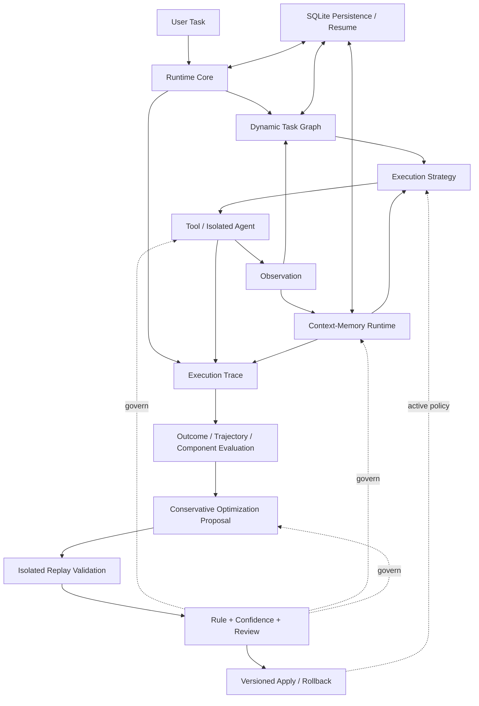

# Adaptive Agent Runtime

面向复杂、长周期任务的自适应智能体运行框架。项目关注的不是如何再封装一个 Agent 应用，而是如何把任务编排、认知资源、外部能力、运行评估和自治边界组织成可验证的 Runtime。

仓库同时提供金融研究场景的 Research Agent，用于验证各模块能够沿一条真实执行链路协同工作。

## 为什么需要 Agent Runtime

简单 ReAct Loop 或固定 Workflow 适合边界清晰的短任务，但任务持续时间增长后会暴露一组相互关联的问题：

- **计划会失效**：执行产生的新信息可能改变后续任务，静态流程无法吸收反馈。
- **Context 会退化**：历史信息持续堆积，Token 消耗增加，但真正影响当前推理的信息比例不断下降。
- **Memory 会污染行为**：未经证据约束的历史记录一旦进入长期记忆，可能在后续任务中被错误复用。
- **失败难以定位**：只评价最终答案，无法判断问题来自规划、工具、Context 还是 Memory。
- **自治能力缺少边界**：允许 Agent 修改任务和状态后，系统必须同时回答“能否执行、依据是否充分、是否需要审核”。

Adaptive Agent Runtime 将这些问题视为同一个运行时问题：Agent 不仅要完成任务，还需要在执行过程中管理状态、认知资源和变更权限，并为每次决策保留可评估的证据。

## 总体架构



Runtime Core 维护顺序反馈循环和不可变状态快照；Orchestration 决定下一项可执行任务；Context-Memory 为当前推理组装信息并管理长期经验；Tool Ecosystem 执行能力调用；Evaluation 将分散的运行记录归一为可分析轨迹；Governance 对可能改变外部环境或内部状态的操作进行分级决策。

Persistence 通过各模块已有的窄接口提供可选 SQLite 实现，持久化 State、Trace、Task Graph Cursor、Context、Archive 与 Memory。Core 只暴露通用 `resume(run_id)`，不会感知 SQLite 或把其他模块状态塞入 `AgentState`；未确认结果的外部动作会阻塞恢复，不会静默重放。

模型接入由 provider-neutral LLM Gateway 提供，包括后端适配、结构化输出、路由、预算和响应校验。它属于运行基础设施，不改变 Runtime 对任务、工具和状态的最终控制权。

Runtime Core 还提供 Run 级统一停止控制：最大动作轮数、聚合 Token/成本、分层时间预算、重复工具调用、状态停滞和关键工具不可恢复失败。墙钟期限默认不启用；长工具使用独立超时和开始前准入，避免被短全局超时误杀。完整语义见 [运行停止机制设计](docs/运行停止机制设计.md)。

## 核心技术设计

### 1. 运行时控制的提案流水线（Runtime-owned Proposal Pipeline）

模型或 Agent 只产生提案（Proposal），不直接获得工具执行和状态修改权限。动作提案必须落在运行时计算出的可执行集合内；任务图变更（Graph Mutation）必须满足节点、依赖与策略白名单；工具意图还要重新经过能力匹配、服务选择和治理授权。

系统将动态能力统一拆分为 **提案生成（Proposal）→ 校验（Validation）→ 治理决策（Governance）→ 执行（Execution）** 四个阶段，使模型负责语义判断，运行时保留最终控制权。授权信息与请求指纹、策略版本和目标快照绑定，避免审批结果被复用于已经变化的操作。

### 2. 版本化动态任务图（Versioned Dynamic Task Graph）

任务图不是可被任意修改的共享对象，而是经过不变量校验的不可变 DAG 快照。节点状态、图版本、动作和观测结果具有明确关联；只有成功执行产生的合法变更才能形成下一版本，失败则沿依赖关系传播阻塞状态。

这种设计在“固定工作流”和“模型自由规划”之间建立了受约束的动态层：执行反馈能够改变后续任务，同时每次变化都可追踪、可验证，也不会绕过调度规则。节点失败后，由失败分类器（Failure Classifier）与恢复规划器（Recovery Planner）生成重试、策略替换、恢复节点或依赖重连方案；恢复计划经过治理审核后写入新图版本并继续调度，而不是直接终止整个计划。

### 3. 基于证据约束的认知状态演化（Evidence-bound Cognitive State Evolution）

上下文压缩（Context Compression）不是覆盖原始内容：运行时会先归档完整快照，再保存核心结论和恢复引用。压缩、归档和恢复均采用版本化写入与冲突检查，失败时执行补偿操作。

每次节点执行前，上下文生命周期管理（Context Lifecycle Runtime）会测量当前 Token 压力，结合信息重要性、驻留策略和访问历史自动选择压缩或归档动作。缺失必要上下文时，会从归档中自动恢复，随后重新调度，并将实际访问情况写回下一版本快照。

记忆更新（Memory Update）同样不是直接覆盖。每个候选记忆必须携带条件、证据、置信度和演化类型。支持关系（Support）用于累积证据，修改关系（Modify）产生新版本，冲突关系（Conflict）保留原结论并记录反证，冲突记忆默认退出召回。通过候选指纹、幂等写入和版本检查共同保证重复执行与并发更新不会静默污染长期状态。

### 4. 从运行轨迹到保守优化提案（Trace-to-Proposal Conservative Evolution）

运行时将不同模块产生的记录统一整理为带有关联信息和覆盖范围的执行事实，而不是简单保存日志文本。结果评估、轨迹分析与组件评估器能够定位失败来源，包括任务结果、执行顺序或具体运行组件；当轨迹信息不完整时，系统会主动降低评估置信度。

失败分析器（Failure Analyzer）按照组件和错误模式聚合跨运行记录。只有当重复失败情况、模式置信度、证据数量和预期收益同时达到阈值时，系统才生成优化提案。

演化运行时（Evolution Runtime）会将提案转换为候选配置，并在持久化重放案例上通过隔离运行时进行非回归验证。验证通过后，仍需经过治理授权才能原子激活下一配置版本。应用后的配置可跨进程读取，回滚同样属于独立的高风险治理操作。


## Research Agent 验证

Research Agent 是 Runtime 之上的展示应用。一次研究任务会经过任务图初始化、能力匹配、工具执行、Context 组装、Memory 召回、风险复核、报告生成、轨迹评估和治理记录，最终返回结构化报告及完整运行快照。

默认模式使用确定性 Fixture，不需要外部模型或 API Key；也可显式配置 OpenAI-compatible API、Anthropic API、Codex CLI 或 Claude Code 后端。

## 快速运行

要求 Python 3.11+。

```powershell
python -m pip install -e .
python examples/minimal_loop.py
python examples/research_demo.py "分析 Tesla 投资价值"
```

启动可视化 Research Runtime Console：

```powershell
python examples/research_web.py
```

然后访问 `http://127.0.0.1:8765`。未激活 LLM 时使用 Fixture Demo；激活 Target 后，“自动”模式优先执行 LLM Research。右上角“LLM 设置”支持获取 Provider 实时模型列表、动态切换模型，并将 Provider API Key 与目标级模型选择保存到被 Git 忽略的 `config/llm.local.toml`。Codex CLI Target 使用启动 Web 服务的宿主用户 OAuth 会话。

Research Agent 的双模式、运行边界和操作说明见 [应用文档](applications/research_agent/README.md)。

Runtime 的私有配置仓库同时持久化 Provider Key 与目标级模型选择。应用可以调用 `TOMLProviderConfigRepository.save_target_selection()` 写入 `[selections.<target-name>]`；加载 Target 时，私有的 `model` 与 `reasoning_effort` 会覆盖 `config/llm.toml` 中的部署默认值。API Target 的探测结果通过 `BackendProbeResult.available_model_ids` 返回实时可用的文本模型列表，界面如何展示与交互由上层应用负责。

持久化运行时在 Composition Root 中显式装配：

```python
from adaptive_agent_runtime.persistence import SQLitePersistence

storage = SQLitePersistence("runtime.sqlite3")
planner = DynamicTaskGraphPlanner(
    initial_graph,
    graph_store=storage.task_graph_store,
)
runtime = AgentRuntime(
    planner=planner,
    executor=executor,
    state_store=storage.state_store,
    trace_sink=storage.trace_sink,
)

# 新运行：await runtime.run(task, run_id=run_id)
# 进程重启后：await runtime.resume(run_id)
```

## 工程验证与实现边界

- 647 个 `unittest` 用例覆盖 Core、Orchestration、Persistence/Resume、Context-Memory、Tool、Evaluation、Governance、Evolution/Replay、LLM 与 Research Agent。
- `mypy --strict` 检查 Runtime 包，数据契约以冻结的 Pydantic Model 和显式 Protocol 为主。
- 当前版本仍使用顺序事件循环，不支持通用并行调度；Store 可选择内存或 SQLite，SQLite 路径支持跨进程 Run Resume。
- 恢复只自动跨越已提交的 Observation。已经开始但没有结果的外部动作会标记为 in-doubt 并阻塞静默重放，需要人工或外部幂等证明解除。
- Evaluation 仍只生成 Proposal；Replay、版本化 Apply 和 Rollback 位于独立 Evolution Runtime，并要求应用注入可隔离重放的执行器。Research Demo 展示 Proposal 与模拟 Review，生产环境需接入真实审批服务和领域 Replay Workload Executor。
