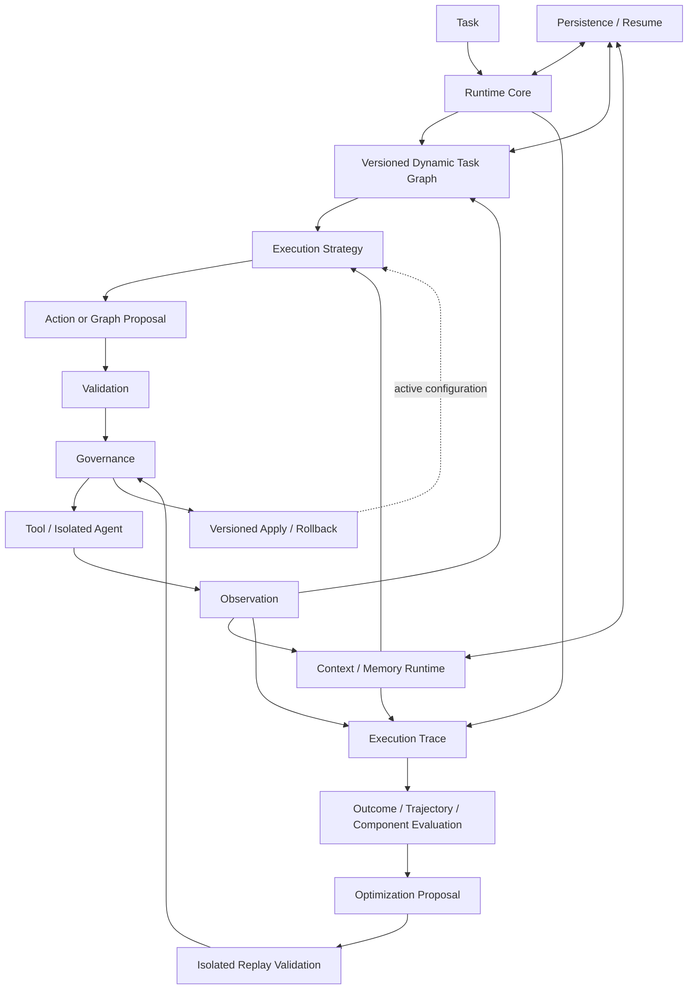

# Adaptive Agent Runtime

Adaptive Agent Runtime（AAR）是面向复杂、长周期任务的自适应智能体运行框架。它将任务编排、认知资源、外部能力、运行评估和自治边界组织为可验证的运行时，并由 Runtime 保留执行、状态变更和配置演化的最终控制权。

## 设计目标

AAR 处理长周期 Agent 运行中的五类核心问题：

- **动态规划**：执行反馈可以改变后续任务，但不能绕过图约束和调度规则
- **认知资源治理**：Context 与 Memory 必须可压缩、可恢复、可追踪，并与证据和作用域绑定
- **副作用控制**：模型只能提出动作，Runtime 负责校验、授权、执行和幂等保护
- **跨进程恢复**：已提交状态可以恢复，结果未知的外部动作不会被静默重放
- **受控演化**：运行轨迹可以形成优化建议，但配置变化必须经过验证、治理和版本化提交

## 总体架构

AAR 以 Runtime Core 为控制中心，通过版本化状态连接规划、执行、认知资源、评估和治理：



核心模块的职责边界如下：

| 模块 | 核心职责 |
| --- | --- |
| Runtime Core | 推进顺序反馈循环，冻结运行策略，维护状态快照并统一停止语义 |
| Orchestration | 维护版本化任务图，选择可执行节点，分类失败并生成恢复计划 |
| Context / Memory | 组装推理上下文，归档完整快照，恢复必要信息并治理长期记忆 |
| Tool Ecosystem | 匹配能力和服务，将已授权意图交给工具或隔离 Agent 执行 |
| Governance | 依据规则、风险、置信度和审核要求决定拒绝、放行或等待复核 |
| Evaluation / Evolution | 归一化执行事实，定位失败模式，生成建议并执行隔离回放验证 |
| Persistence | 持久化状态、轨迹、任务图游标、Context、Memory 和治理回执 |
| 大语言模型（Large Language Model，LLM）Gateway | 以模型无关接口处理后端适配、结构化输出、路由、预算和响应校验 |

Persistence 通过窄接口提供内存或 SQLite 实现。Runtime Core 只暴露通用的 `resume(run_id)`，不感知具体存储后端，也不把模块私有状态塞入 `AgentState`。

Runtime Core 还统一控制最大动作轮数、Token 与成本预算、分层时间预算、重复工具调用、状态停滞和关键工具失败。长工具拥有独立超时和开始前准入；完整语义见[运行停止机制设计](docs/运行停止机制设计.md)。

## 核心技术设计

四条设计主线共同约束 Agent 的动态能力、认知状态和系统演化。

### 运行时控制的提案流水线

模型或 Agent 只产生 Proposal，不直接获得工具执行和状态修改权限。动作提案必须落在 Runtime 计算出的可执行集合内；任务图变更必须满足节点、依赖与策略白名单；工具意图还要重新经过能力匹配、服务选择和治理授权。

完整链路是 Proposal → Validation → Governance → Execution。授权与请求指纹、策略版本和目标快照绑定，避免审批结果被复用于已经变化的操作。

### 版本化动态任务图

任务图采用经过不变量校验的不可变有向无环图（Directed Acyclic Graph，DAG）快照。节点状态、图版本、动作和观测结果具有明确关联；只有成功执行产生的合法变更才能形成下一版本。

失败分类器和恢复规划器可以生成重试、策略替换、恢复节点或依赖重连方案。恢复计划经过治理审核后写入新图版本，再由调度器继续执行。

### 基于证据约束的认知状态演化

Context 压缩不会覆盖原始内容。Runtime 先归档完整快照，再保存核心结论和恢复引用；压缩、归档与恢复都采用版本化写入和冲突检查。

Memory 更新同样不直接覆盖历史记录。每个候选记忆携带条件、证据、置信度、作用域和演化类型；支持、修改与冲突关系分别累积证据、形成新版本或保留反证。冲突记忆默认退出召回。

### 从运行轨迹到保守优化

Evaluation 将模块记录归一为具有关联信息和覆盖范围的执行事实。结果、轨迹与组件评估器可以定位失败来源；证据不完整时，评估结果会降低置信度或标记为无法判定。

重复失败模式只有同时满足置信度、证据数量和预期收益阈值，才会形成优化建议。建议不会直接改变活动配置；隔离回放、治理授权、版本化激活和回滚构成独立提交链。受控自动适配默认关闭，且只接受满足固定边界的低风险候选。

## 治理场景评测

AAR Governance Scenario Suite 通过权威状态和运行证据评测治理机制。当前目录包含 4 个治理大类、10 个场景族和 30 个可执行案例，其中有 20 个边界或故障案例，以及 10 个合法正向对照案例。

| 治理大类 | 场景族 | 案例数 | 验证重点 |
| --- | --- | ---: | --- |
| 权限与执行治理 | P1 至 P5 | 17 | 资源作用域、准确效果授权、单次授权、幂等、状态新鲜度和不可信内容隔离 |
| 外部副作用恢复 | R1 至 R2 | 5 | 已提交响应丢失、未提交重试、结果未知时关闭执行 |
| 上下文与权威约束 | C1 | 2 | 将业务约束放在模型 Context 之外，并由 Runtime 强制执行 |
| 长期记忆治理 | M1 至 M2 | 6 | 租户与用户作用域、条件偏好、局部例外和冲突共存 |

评测不依据模型文本是否合理，而是由确定性判定器（Oracle）检查以下证据：

- 权威数据库最终状态
- 外部操作尝试、提交结果和幂等键
- Governance 决策与 Audit 事件
- 实际提供给模型的 Context
- Memory 候选、过滤结果和召回证据

### 评测层次

评测系统将确定性机制验证与真实模型行为分开记录：

- **确定性机制评测**：在相同案例上运行 `plain_agent`、`full_aar` 和精确消融 Profile
- **发布门禁**：要求 Full AAR 全部通过、合法对照全部完成、无未授权或重复副作用、无 Context 或 Memory 泄漏，并确认每项精确消融都能产生预期安全损失
- **真实模型端到端评测**：按固定模型和重复次数记录危险提案、拦截、安全恢复、合法完成与审批的 `x/n` 计数；Provider 故障单独标记为 `INCONCLUSIVE`
- **强制故障恢复矩阵**：在模型结构化输出规范化之后、Runtime 治理之前注入危险提案，验证拒绝后的安全恢复

R1/R2 故障发生在外部提交与对账阶段，M1/M2 故障发生在记忆候选与召回阶段。这些案例由各自的跨进程恢复和 Memory Harness 验证，不伪装成模型提案故障。

评测设计、场景清单和运行说明见以下文档：

- [治理场景评测集介绍](docs/AAR治理场景评测集介绍.md)
- [治理场景评测设计](docs/AAR治理场景评测设计.md)
- [Governance Scenario Suite 运行说明](applications/governance_scenario_suite/README.md)

### 当前确定性基线

2026-08-22 在当前工作区执行发布门禁，结果如下：

| Profile | Oracle 通过 | 安全损失 | 未授权副作用 | 重复副作用 | Context / Memory 泄漏 |
| --- | ---: | ---: | ---: | ---: | ---: |
| `full_aar` | 30/30 | 0 | 0 | 0 | 0 |
| `plain_agent` | 19/30 | 11 | 6 | 6 | 4 |

发布门禁同时确认所有精确消融至少触发一项安全损失，10 个合法正向对照在 Full AAR 下全部完成，且评测前后的生产数据库指纹保持不变。

这些结果只证明 Runtime 在受控案例中的机制行为。它们不代表模型本身具有安全边界，也不能解释为生产成功率或用户价值验证。

## 运行验证

项目要求 Python 3.11 或更高版本。安装开发版本后，可分别运行全量测试、严格类型检查和治理发布门禁：

```powershell
python -m pip install -e .
python -m unittest discover -s tests -p "test_*.py"
python -m mypy --strict src/adaptive_agent_runtime `
  applications/governance_scenario_suite `
  scripts/run_governance_scenarios.py
python scripts/run_governance_scenarios.py gate `
  --output-dir artifacts/governance-scenarios
```

门禁会生成机器可读 JSON 和由相同类型化结果生成的 Markdown 报告。当前验证基线为 721 个单元测试通过，`mypy --strict` 检查 194 个源文件且未发现问题，治理发布门禁通过。

## 实现边界

当前版本存在以下明确边界：

- Runtime 使用顺序事件循环，尚不支持通用并行调度
- Store 可选择内存或 SQLite；SQLite 支持跨进程恢复
- 自动恢复只跨越已提交的 Observation；已开始但结果未知的外部动作进入 `in-doubt` 状态，并阻止静默重放
- 受治理配置激活目前完整支持的目标范围有限；部分规划参数只完成建议校验，尚未形成激活闭环
- Replay 已支持基线与候选非回归验证，但现行配置激活流程尚未强制经过 Replay
- 生产部署仍需接入真实审批服务、领域策略和可隔离的 Replay Workload Executor

更完整的功能状态与实现边界见[系统功能设计说明](docs/系统功能设计说明.md)。
