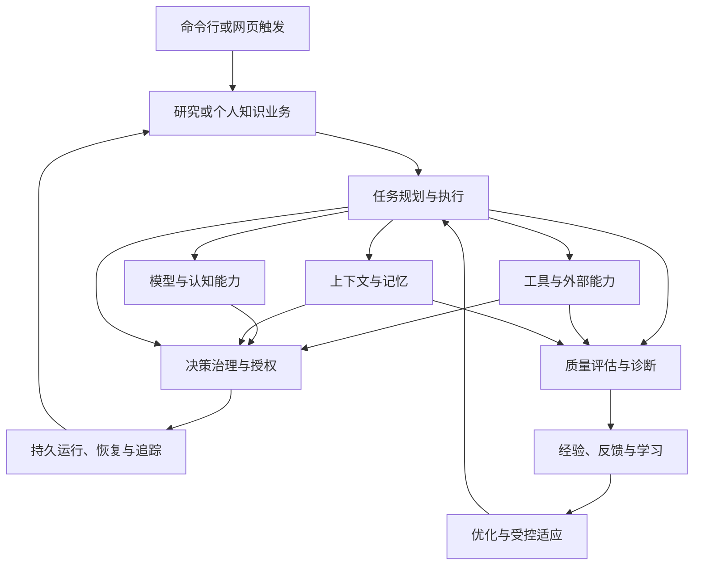
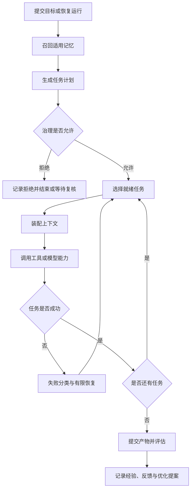
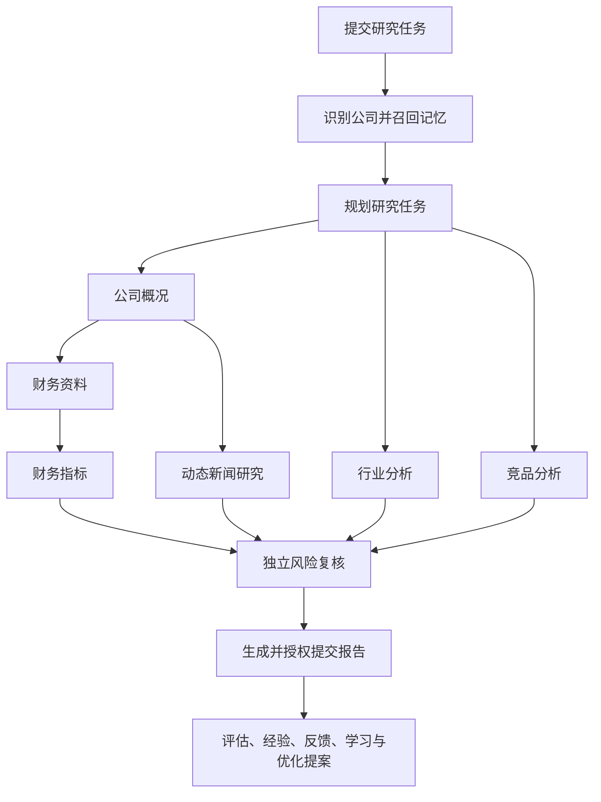
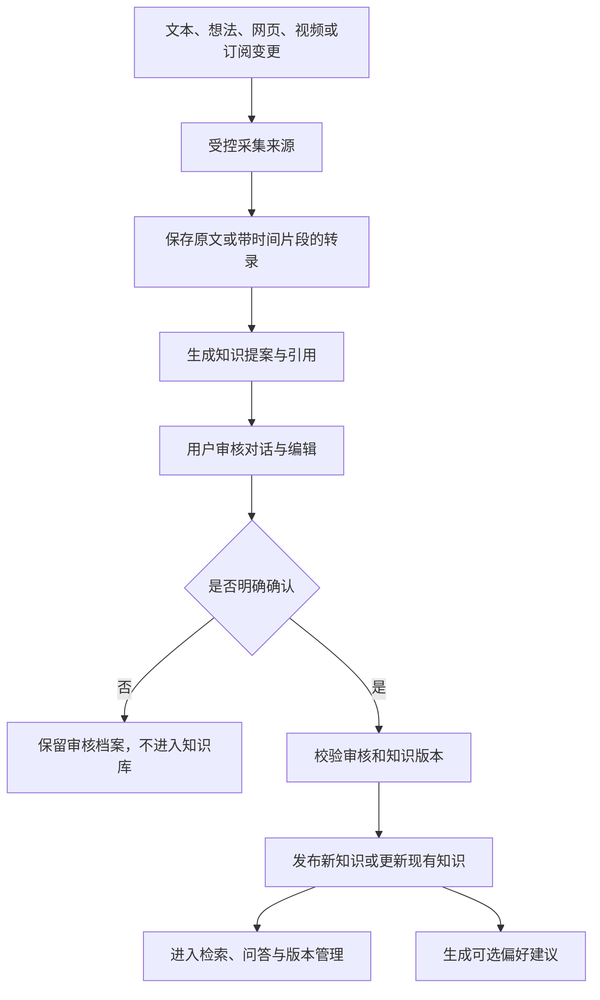
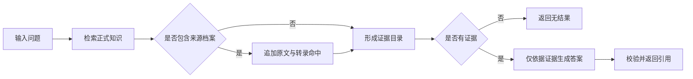
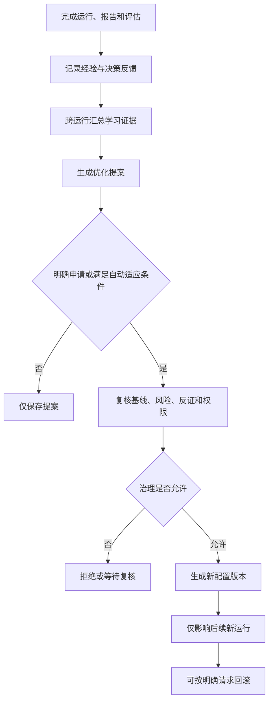

# 系统功能设计说明

> 本说明由当前项目代码、运行配置与自动化测试反向整理，不引用项目内已有设计文档。内容只描述代码已经体现的产品功能、业务规则和功能边界，不展开代码架构、类设计或技术实现。

## 1. 系统功能概述

### 1.1 系统整体用途

当前系统是一套面向自适应智能体的受控运行系统，并提供两个可直接使用的业务应用：投资研究工作台和个人知识库。

系统能够把用户目标转化为分步骤任务，调用合适的信息或计算能力，控制模型及工具的使用权限，在执行过程中维护上下文与跨任务记忆，并在任务结束后完成报告生成、质量评估、经验记录和有限范围的优化。个人知识库则把文本、网页、视频等来源转化为待审知识，经用户确认后发布，并支持检索、问答、订阅和偏好记忆。

### 1.2 主要解决的问题

- 将开放式目标转化为可执行、可追踪的任务过程，减少一次性生成结果的不确定性。
- 限制模型、工具和状态变更的权限，避免未经审查的建议直接改变系统状态。
- 在长流程中控制上下文规模，并在需要时压缩、归档和恢复上下文。
- 保存执行状态、决策、授权、产物和评估结果，使中断后的任务可以继续，重复请求不会造成重复写入。
- 记录跨任务记忆、执行经验和结果反馈，为后续规划与受控优化提供依据。
- 将分散的个人资料转化为经过用户确认的知识，保留来源、版本和引用关系。

### 1.3 当前实现的核心能力

- 目标驱动的多步骤任务执行、分支汇合、动态任务补充和失败恢复。
- 能力匹配、工具选择、调用审批、超时重试、候选切换和结果追踪。
- 多模型目标配置、连通性探测、模型发现、结构化输出校验和受限模型路由。
- 上下文分层装配、容量控制、语义压缩、归档恢复和条件记忆召回。
- 规则、风险、置信度和人工复核相结合的决策治理，以及一次性授权消费。
- 执行结果、过程轨迹和功能组件的独立评估，以及失败原因分析。
- 执行经验、决策结果反馈、跨任务学习结论、优化提案和受控配置变更。
- 投资研究的资料分析、风险复核、研究报告发布和实时进度展示。
- 个人知识的采集、审核、确认发布、分类、版本、检索、问答、订阅和偏好管理。
- 关键状态与产物的持久保存、跨进程恢复、幂等提交和冲突检测。

## 2. 功能模块设计

### 2.1 投资研究

**功能目标**

根据用户输入的公司研究目标，组织完整的投资研究过程，并输出带有财务、行业、竞争、新闻和风险观点的结构化研究报告。

**功能描述**

系统从研究任务中识别公司，生成研究计划，分别完成公司概况、财务资料、指标计算、行业分析和竞品分析；发现需要新闻信息时可动态补充新闻任务。各项分析完成后执行独立风险复核，再形成研究报告。运行结束后继续生成质量评估、经验、决策反馈、学习结论和优化提案。

**包含的主要功能点**

- 研究任务提交与公司识别。
- 固定规则规划或模型辅助规划。
- 公司、财务、行业、竞品、新闻和风险研究。
- 动态补充新闻研究及调整依赖。
- 离线演示研究与模型研究两种信息模式。
- 结构化报告生成、权威提交和 Markdown 展示。
- 同步执行、异步执行、实时进度和最终结果读取。
- 运行恢复、运行后评估、经验记录和优化提案。

**与其他功能模块的关系**

研究流程以任务执行为主线，依赖工具服务获取或生成研究信息，依赖上下文与记忆提供运行内和跨运行信息，所有关键变更经决策治理控制，最终由评估学习和持久恢复模块完成闭环记录。

### 2.2 个人知识管理

**功能目标**

把用户提供或订阅获得的内容转化为可审阅、可确认、可检索、可追溯的个人知识，同时确保未经确认的内容不会进入正式知识库。

**功能描述**

系统支持手工文本、想法、网页和视频来源。采集后的原始资料先进入来源档案，系统生成知识提案并开启审核会话。用户可以继续对话修订提案，也可以在确认界面编辑标题、正文、分类、标签和引用。只有提交与当前审核版本一致的明确确认后，内容才会发布或覆盖现有知识。

**包含的主要功能点**

- 文本录入、想法捕获、网页正文采集和视频转录采集。
- 原始来源、正文或转录、时间片段和引用归档。
- 自动知识提案、长内容分段综合和审核对话修订。
- 可编辑确认发布、已有知识修订、删除与恢复。
- 分类创建、重命名、停用和合并。
- 当前知识与历史版本保存。
- 正式知识优先的全文检索，以及可选来源档案检索。
- 基于检索证据的问答与引用返回。
- 网页或视频订阅、变更检测、定时轮询和变更后发起审核。
- 明确偏好记录、推断偏好建议及确认后写入。
- 离线综合与模型综合之间的运行时切换。

**与其他功能模块的关系**

内容采集依赖工具服务和治理授权；知识综合、问答和偏好推断可使用模型服务；用户偏好存放在跨任务记忆中；所有正式知识写入依赖明确确认和版本一致性检查；来源、知识、审核和订阅由持久恢复能力保存。

### 2.3 任务规划与执行

**功能目标**

把复杂目标拆分为有依赖关系的任务，并按照可执行条件推进，直到完成、失败或达到运行限制。

**功能描述**

系统支持线性任务、并行就绪分支和汇合任务。运行时只执行依赖已满足的任务；执行结果会形成新的状态快照并反馈给后续规划。计划可在受控范围内增加任务或依赖。节点失败时，依赖节点会被阻塞，系统可根据失败类型重试、替换策略、增加恢复任务、调整依赖或终止运行。

**包含的主要功能点**

- 单步和多步目标执行。
- 有向任务关系、分支、汇合和就绪任务选择。
- 固定规则规划与模型辅助规划。
- 动态增加任务与调整依赖。
- 失败分类、有限重试、替代策略和恢复任务。
- 最大步骤、最大节点和恢复次数限制。
- 每次运行的任务图与状态隔离。

**与其他功能模块的关系**

任务节点通过工具服务和模型能力完成工作；上下文模块为节点装配所需信息；治理模块控制规划、任务选择、图变更和恢复方案；持久恢复模块保存执行检查点；评估模块在结束后判断结果和过程质量。

### 2.4 工具与外部能力使用

**功能目标**

让任务按照所需能力选择可用工具，并以受控、可重试、可追踪的方式执行。

**功能描述**

系统先按能力和约束筛选候选工具，再通过稳定规则或模型建议选择具体提供者。工具参数须满足约束，调用前需要通过治理。执行过程记录每次尝试，可处理明确失败、异常、超时和提供者临时不可用，并按策略重试或切换候选。工具结果被标准化后进入任务上下文。

**包含的主要功能点**

- 能力登记、提供者登记和候选匹配。
- 按标签、约束、优先级和可用性筛选。
- 确定性选择和模型辅助选择。
- 参数约束与调用提案校验。
- 调用授权、超时、重试、候选切换和取消处理。
- 成功与失败结果标准化。
- 调用尝试、观察结果和关联关系追踪。

**与其他功能模块的关系**

任务执行发起能力请求；模型只能提出工具意图，不能直接执行；治理模块决定是否允许调用；工具结果进入上下文和评估；持久恢复与追踪能力用于判断是否可以安全重放。

### 2.5 模型与认知能力

**功能目标**

把外部模型作为可替换、可探测、受预算和输出契约约束的认知服务，而不是直接拥有系统状态变更权限。

**功能描述**

系统支持多种远程或本地模型目标。使用前可以检查运行环境、身份状态、连接和模型可用性，并发现可选模型。请求会按目标能力、标签和预算路由；失败时可在允许范围内重试或切换。模型结果必须符合声明的结构，工具调用仅作为意图返回给系统再次审查。

**包含的主要功能点**

- OpenAI 兼容服务、Anthropic API、本地兼容服务、Codex CLI 会话和 Claude Code 会话。
- OpenAI、通义千问国内与国际端点、DeepSeek及自定义本地端点预设。
- 模型目标选择、密钥隔离保存、敏感配置遮蔽。
- 目标探测、认证判断、模型列表发现和运行时切换。
- 路由、重试、回退、次数、时间、成本和输出长度预算。
- JSON 对象或结构化结果校验。
- 推理、任务规划、动作建议、图变更、内容生成、证据判断、根因分析、恢复、工具选择、上下文压缩和记忆提取。
- 上下文敏感级别控制、字段脱敏和外发容量限制。
- 受限的自主代理只读或工作区写入执行。

**与其他功能模块的关系**

模型能力为研究、知识综合、问答、规划、诊断和记忆提取提供建议；其输入由上下文模块投影，输出由任务、工具或决策模块校验；任何有状态影响的结果仍须经过治理和授权。

### 2.6 上下文与记忆

**功能目标**

在有限容量内为当前任务提供相关信息，并保存有条件、有证据、可演进的跨任务记忆。

**功能描述**

上下文按工作、任务和语义三层组织，根据任务需要、重要性和容量进行装配。容量压力出现时，可压缩非固定上下文并归档；后续任务明确需要时可以恢复。记忆包含适用范围、条件、敏感级别、证据和置信度，支持新增、支持、修改和冲突四种演进方式。召回时需同时满足作用域、事实、标签、状态和敏感性条件。

**包含的主要功能点**

- 对话、观察、工具结果、文档、记忆和中间结果转为上下文。
- 三层上下文调度、必需内容优先和容量限制。
- 固定、会话和临时驻留策略。
- 压缩、归档、恢复及失败补偿。
- 条件记忆召回、作用域隔离和敏感内容过滤或脱敏。
- 记忆新增、证据强化、内容修改、冲突保留和停用状态。
- 初始规划前的跨运行记忆召回。
- 模型提出记忆候选，系统审查后批量提交。

**与其他功能模块的关系**

任务和工具结果产生上下文；模型服务只接收允许外发的投影；记忆写入、压缩和恢复均受治理控制；经验学习使用已提交记忆作为证据，但不会未经授权直接改写记忆。

### 2.7 决策治理与授权

**功能目标**

确保模型建议、工具调用和关键状态变更在明确的规则、风险和证据边界内执行，并留下可核验的授权记录。

**功能描述**

每项受控操作先形成请求和影响范围，再由规则与置信度判定允许、拒绝或需要复核。复核通过后才签发与具体操作内容绑定的授权。授权只能使用一次，内容改变、对象不匹配、过期、伪造或重复使用均会被拒绝。决策过程可以在等待复核或提交中断后恢复。

**包含的主要功能点**

- 规则允许、规则拒绝、风险分级和置信度判断。
- 人工复核请求、复核结果和跨进程继续。
- 与操作内容绑定的一次性授权。
- 授权预留、消费、失败消费和重放防护。
- 规划、工具、记忆、上下文、图变更、恢复、报告和配置变更的统一治理。
- 决策上下文隔离、预算控制、过期校验和故障检查点。

**与其他功能模块的关系**

治理是所有有副作用能力的基础控制层。任务规划、工具调用、知识写入、记忆演进、报告发布和优化配置变更都依赖治理；追踪与持久恢复模块保存其证据和状态。

### 2.8 运行质量评估与诊断

**功能目标**

在任务结束后分别判断结果是否达成、执行过程是否合理、各基础能力是否正常，并形成可供复盘的失败分析。

**功能描述**

系统汇总运行状态、任务轨迹、工具记录、任务图、恢复记录、上下文和记忆快照，检查目标完成度、输出要求、事件顺序、轨迹完整性和组件表现。评估结果可为通过、失败或证据不足。系统还会提取重复失败模式，生成确定性失败分析；配置模型能力时可增加隔离的证据判断和根因分析，但不能反向改写已发布报告。

**包含的主要功能点**

- 目标结果评估、执行轨迹评估和组件评估。
- 运行与工具记录关联、顺序和完整性检查。
- 任务执行、工具、上下文与记忆的分项结论。
- 失败模式聚合、根因候选和恢复诊断证据。
- 可选模型证据判断和根因分析。
- 评估结果持久保存。

**与其他功能模块的关系**

评估消费任务、工具、上下文和追踪结果；其结论供经验、反馈、学习和优化使用；根因证据可以辅助后续恢复，但运行后分析不能修改已完成的业务产物。

### 2.9 经验、反馈与学习

**功能目标**

把已完成运行的真实结果转化为可审计的经验和学习证据，避免把模型自评或缺失证据误当成成功。

**功能描述**

只有运行结束、评估存在且业务产物已经正式提交后，系统才生成经验元数据。系统还会为已实际执行的规划和记忆召回决策记录结果反馈，明确区分相关性与因果性。多个已完成运行满足作用域和证据要求后，可以形成学习结论；相互冲突的证据会被保留，证据不足不会被提升为正向信号。

**包含的主要功能点**

- 完成运行的经验元数据生成。
- 经验与运行、产物、评估、记忆之间的关联。
- 规划与记忆召回结果反馈。
- 反馈追加保存、幂等提交和来源一致性校验。
- 多运行学习、作用域隔离、反证保留和证据不足处理。
- 学习结论的治理提交和持久保存。

**与其他功能模块的关系**

经验和反馈依赖已完成运行、正式产物和评估；学习结论是优化提案的证据来源。目前学习结论不会直接改写规划、记忆或业务结果。

### 2.10 优化与受控适应

**功能目标**

基于已验证的跨运行学习证据提出有限范围的配置优化，并确保提案、应用、回滚和自动应用彼此分离。

**功能描述**

系统首先生成不可直接执行的优化提案，保存当前基线、证据、反证、风险和建议值。只有收到独立的应用请求并再次完成治理后，才能生成新配置版本；回滚也会生成新的配置版本而非删除历史。可选自动适应只在固定范围、单一低风险提案、无反证、基线未变化且变更幅度符合约束时执行，默认关闭。

**包含的主要功能点**

- 基于学习证据的优化提案。
- 提案与实际配置变更分离。
- 基线新鲜度、作用域、目标、证据和反证校验。
- 明确请求后的配置应用、版本化生效和幂等恢复。
- 回滚到先前值并保留新版本记录。
- 受限自动适应、候选唯一性检查和失败封闭。
- 新运行读取新配置，已开始运行保持原配置快照。

**与其他功能模块的关系**

优化依赖评估、反馈和学习证据；配置变更依赖治理与持久提交；任务规划读取当前生效配置。当前可变目标仅覆盖研究初始规划的最大节点数。

### 2.11 持久运行、恢复与追踪

**功能目标**

保证长流程在中断、重启、重复请求或并发提交情况下仍能保持一致，并提供完整审计线索。

**功能描述**

系统保存运行状态、任务图、上下文、记忆、决策检查点、复核、授权、业务产物、评估、经验、反馈、学习和配置版本。恢复时从最近检查点继续，已经正式提交的结果不会重复生成或重复写入；无法判断结果的非幂等操作会进入未知状态并停止自动重放。

**包含的主要功能点**

- 状态快照、当前状态和运行轨迹保存。
- 任务图检查点、历史和恢复记录保存。
- 上下文、记忆、召回包及归档恢复保存。
- 决策、复核、授权使用和业务产物保存。
- 跨进程继续研究运行和决策流程。
- 重复提交复用原结果、内容冲突拒绝。
- 并发原子提交和失败回滚。
- 同步结果、异步进度事件和最终结果查询。

**与其他功能模块的关系**

该模块为所有业务和基础能力提供持续性与审计性，是中断恢复、幂等执行、结果评估和治理证明的共同基础。

## 3. 功能清单

状态判定说明：代码存在完整触发入口、处理过程和可验证结果时记为“已实现”；能力受固定范围、外部依赖、默认关闭或用户入口限制时记为“部分实现”；代码仅体现占位、旧版隔离能力或尚未形成可用闭环时记为“疑似未完成”。

| 功能模块 | 功能名称 | 功能说明 | 实现状态 |
| --- | --- | --- | --- |
| 投资研究 | 研究任务提交 | 接收研究目标并识别研究公司 | 已实现 |
| 投资研究 | 离线演示研究 | 使用稳定演示数据完成完整研究流程 | 已实现 |
| 投资研究 | 模型研究模式 | 使用已配置模型生成公司、行业、竞品、新闻和财务相关信息 | 已实现 |
| 投资研究 | 初始研究规划 | 在运行前形成并治理研究任务计划 | 已实现 |
| 投资研究 | 公司概况研究 | 形成公司身份、业务概况和研究范围 | 已实现 |
| 投资研究 | 财务资料分析 | 获取或生成标准化财务资料观察 | 已实现 |
| 投资研究 | 财务指标计算 | 计算增长、利润率、杠杆等投资指标 | 已实现 |
| 投资研究 | 行业分析 | 输出行业驱动因素、结构和前景 | 已实现 |
| 投资研究 | 竞品分析 | 输出同业对比和差异化判断 | 已实现 |
| 投资研究 | 动态新闻研究 | 运行中补充新闻任务并纳入风险依赖 | 已实现 |
| 投资研究 | 独立风险复核 | 对分析结果形成风险与反方观点 | 已实现 |
| 投资研究 | 可选隔离风险代理 | 允许受限自主代理在隔离环境执行风险复核 | 部分实现 |
| 投资研究 | 结构化研究报告 | 输出摘要、分析章节、风险和投资观点及 Markdown | 已实现 |
| 投资研究 | 报告正式提交 | 报告经独立决策和授权后形成权威产物回执 | 已实现 |
| 投资研究 | 运行结果综合展示 | 返回报告、任务图、评估、记忆、治理和学习等结果 | 已实现 |
| 投资研究 | 实时进度 | 按运行事件推送准备、任务变化、工具和完成状态 | 已实现 |
| 投资研究 | 同步与异步运行 | 支持直接等待结果及后台运行后查询结果 | 已实现 |
| 投资研究 | 中断恢复 | 根据运行标识继续未完成研究且不重复规划或发布 | 已实现 |
| 投资研究 | 真实外部研究数据校验 | 直接连接证券行情、公告或新闻检索源并验证时效 | 疑似未完成 |
| 个人知识 | 手工文本采集 | 录入文本和可选标题、备注 | 已实现 |
| 个人知识 | 想法捕获 | 将用户想法作为来源并进入审核 | 已实现 |
| 个人知识 | 网页正文采集 | 获取公开网页并提取标题和正文，拒绝本地或私有地址 | 已实现 |
| 个人知识 | 视频转录采集 | 调用外部转录助手生成带时间片段的转录 | 部分实现 |
| 个人知识 | 来源档案 | 保存来源、原文或转录、内容摘要值和时间片段 | 已实现 |
| 个人知识 | 自动知识提案 | 根据来源生成标题、正文、分类建议、标签和引用 | 已实现 |
| 个人知识 | 长内容分段综合 | 对超长来源分段处理后再汇总提案 | 已实现 |
| 个人知识 | 审核对话修订 | 用户追加指令后生成新的提案和草稿版本 | 已实现 |
| 个人知识 | 可编辑确认发布 | 用户编辑最终内容并明确确认后写入正式知识 | 已实现 |
| 个人知识 | 旧审核防写入 | 审核版本或条目版本变化后拒绝过期确认 | 已实现 |
| 个人知识 | 已有知识修订 | 从当前知识创建审核并确认覆盖 | 已实现 |
| 个人知识 | 知识删除与恢复 | 通过明确确认进入可恢复回收站或恢复 | 已实现 |
| 个人知识 | 知识版本历史 | 保存当前版本及有限数量的历史版本 | 已实现 |
| 个人知识 | 版本历史用户查询 | 通过现有网页界面查看单条知识历史版本 | 疑似未完成 |
| 个人知识 | 分类创建与重命名 | 明确确认后新增或修改分类 | 已实现 |
| 个人知识 | 分类停用与合并 | 校验现有知识后停用分类或合并并重分类 | 已实现 |
| 个人知识 | 正式知识全文检索 | 默认只检索已确认且未删除的知识 | 已实现 |
| 个人知识 | 来源档案检索 | 可选把原始来源和转录加入检索结果 | 已实现 |
| 个人知识 | 基于证据的知识问答 | 只依据检索结果回答并返回引用 | 已实现 |
| 个人知识 | 来源订阅创建 | 创建网页或视频定时订阅 | 已实现 |
| 个人知识 | 订阅变更检测 | 内容摘要变化时自动创建新审核，无变化时不重复创建 | 已实现 |
| 个人知识 | 订阅定时轮询 | 本地调度器按间隔轮询，也支持立即轮询 | 已实现 |
| 个人知识 | 订阅编辑、停用与删除 | 通过用户入口维护既有订阅状态 | 疑似未完成 |
| 个人知识 | 明确偏好记忆 | 用户直接确认偏好后写入应用专属记忆 | 已实现 |
| 个人知识 | 推断偏好建议 | 根据审核编辑行为生成候选偏好，不直接写入 | 部分实现 |
| 个人知识 | 偏好确认 | 用户确认候选后写入记忆 | 已实现 |
| 个人知识 | 本地网页工作台 | 展示知识、审核、分类、回收站、订阅和模型状态 | 已实现 |
| 任务执行 | 多步骤运行循环 | 根据计划推进动作、观察和后续决策 | 已实现 |
| 任务执行 | 分支与汇合 | 并行暴露无相互依赖的就绪任务并等待汇合条件 | 已实现 |
| 任务执行 | 模型辅助就绪任务选择 | 模型只能从系统给出的就绪集合中提出选择 | 已实现 |
| 任务执行 | 动态任务图变更 | 在校验和治理后增加节点或依赖 | 已实现 |
| 任务执行 | 依赖失败传播 | 失败节点阻止依赖任务继续并形成明确状态 | 已实现 |
| 任务执行 | 失败分类与恢复 | 支持重试、替换策略、恢复节点、重连依赖和终止 | 已实现 |
| 任务执行 | 运行资源上限 | 限制步骤、节点、恢复次数及决策预算 | 已实现 |
| 工具使用 | 能力与提供者登记 | 维护工具能力及一个能力的多个提供者 | 已实现 |
| 工具使用 | 候选筛选与稳定选择 | 根据约束、标签、优先级和可用性选择工具 | 已实现 |
| 工具使用 | 模型辅助工具选择 | 模型从系统候选集中建议工具，越界建议被拒绝 | 已实现 |
| 工具使用 | 模型工具意图回交 | 模型仅返回意图，由系统重新选择、治理和执行 | 已实现 |
| 工具使用 | 调用超时与重试 | 记录尝试历史并处理失败、超时和临时不可用 | 已实现 |
| 工具使用 | 工具候选切换 | 失败恢复时可重新选择替代提供者 | 已实现 |
| 工具使用 | 工具观察进入上下文 | 成功或失败结果都转为后续任务可用的观察 | 已实现 |
| 模型服务 | 多模型目标配置 | 配置远程、本地或命令行会话模型目标 | 已实现 |
| 模型服务 | 密钥隔离与遮蔽 | 私密密钥单独保存且查询结果不返回明文 | 已实现 |
| 模型服务 | 模型探测与发现 | 检查可用性、认证、版本、目标模型和模型列表 | 已实现 |
| 模型服务 | 运行时模型切换 | 网页中选择并激活模型，无需重启应用 | 已实现 |
| 模型服务 | 能力协商 | 使用前校验目标是否支持所需认知能力和输出形式 | 已实现 |
| 模型服务 | 请求路由与回退 | 按允许目标、偏好、标签和失败策略选择或切换 | 已实现 |
| 模型服务 | 次数、时间、成本和输出预算 | 超出预算时停止请求或回退链 | 已实现 |
| 模型服务 | 结构化输出校验 | 在提供方结果返回后再次执行本地结构校验 | 已实现 |
| 模型服务 | 上下文外发控制 | 按敏感级别过滤、字段脱敏并限制容量 | 已实现 |
| 模型服务 | 通用自主代理执行 | 支持只读或明确工作区写入的隔离执行与动作预算 | 部分实现 |
| 上下文与记忆 | 多来源上下文采集 | 收集目标、工具、观察、文档、记忆和中间结果 | 已实现 |
| 上下文与记忆 | 三层上下文装配 | 按工作、任务、语义层和预算排序装配 | 已实现 |
| 上下文与记忆 | 上下文容量压力处理 | 自动压缩并在需要时归档非固定内容 | 已实现 |
| 上下文与记忆 | 上下文恢复 | 任务要求已归档内容时恢复后再装配 | 已实现 |
| 上下文与记忆 | 条件记忆召回 | 按作用域、事实、标签、状态和敏感性筛选 | 已实现 |
| 上下文与记忆 | 记忆证据演进 | 支持新增、支持、修改和冲突并保留证据 | 已实现 |
| 上下文与记忆 | 初始规划记忆召回 | 研究运行开始时召回跨运行记忆并绑定召回快照 | 已实现 |
| 上下文与记忆 | 模型记忆提取 | 模型提出候选，系统限制候选来源和演进对象后提交 | 部分实现 |
| 决策治理 | 规则与置信度决策 | 形成允许、拒绝或要求复核的结论 | 已实现 |
| 决策治理 | 风险分级 | 依据操作范围和影响应用不同治理要求 | 已实现 |
| 决策治理 | 人工复核检查点 | 保存待复核状态并支持重启后继续 | 已实现 |
| 决策治理 | 面向用户的研究复核操作台 | 让真实用户查看并处理研究运行中的待复核请求 | 疑似未完成 |
| 决策治理 | 一次性授权 | 授权绑定具体内容，只能消费一次 | 已实现 |
| 决策治理 | 伪造、错配与重放拒绝 | 对无授权、内容变化或重复使用进行拒绝 | 已实现 |
| 决策治理 | 决策预算与过期 | 限制模型调用、修订、耗时和成本并检查基线变化 | 已实现 |
| 质量评估 | 结果达成评估 | 检查运行完成状态与必需输出 | 已实现 |
| 质量评估 | 过程轨迹评估 | 检查顺序、恢复次数、冲突和完整性 | 已实现 |
| 质量评估 | 组件分项评估 | 分别判断任务、工具、上下文与记忆表现 | 已实现 |
| 质量评估 | 确定性失败分析 | 汇总失败结论并识别重复模式 | 已实现 |
| 质量评估 | 模型证据判断 | 可选生成隔离判断，不覆盖确定性评估 | 已实现 |
| 质量评估 | 模型根因分析 | 可选形成根因证据并供恢复参考 | 已实现 |
| 经验学习 | 运行经验元数据 | 仅从已完成运行、正式产物和评估生成经验 | 已实现 |
| 经验学习 | 决策结果反馈 | 记录规划和记忆召回的实际结果与证据充分性 | 已实现 |
| 经验学习 | 多运行学习结论 | 基于多个同作用域运行形成可审计结论 | 已实现 |
| 经验学习 | 反证保留 | 不把冲突或缺失反馈解释为成功 | 已实现 |
| 经验学习 | 学习结果直接影响规划或召回 | 将已保存学习结论自动用于后续决策 | 疑似未完成 |
| 优化适应 | 优化提案 | 基于已验证学习证据提出受限配置建议 | 已实现 |
| 优化适应 | 提案独立保存 | 保存提案不会改变当前行为 | 已实现 |
| 优化适应 | 明确应用 | 独立请求和治理通过后生成新配置版本 | 部分实现 |
| 优化适应 | 配置回滚 | 回滚到先前值并创建新修订 | 部分实现 |
| 优化适应 | 自动适应 | 默认关闭，仅允许唯一、低风险、无反证的固定幅度变更 | 部分实现 |
| 优化适应 | 多参数优化 | 对多个运行参数或业务策略执行通用优化 | 疑似未完成 |
| 持久恢复 | 运行状态与轨迹保存 | 保存每次运行状态快照和事件 | 已实现 |
| 持久恢复 | 任务图检查点 | 保存任务图、历史和恢复记录 | 已实现 |
| 持久恢复 | 决策跨进程继续 | 在复核、授权、应用和提交边界继续 | 已实现 |
| 持久恢复 | 产物幂等提交 | 重复请求返回原回执，内容变化则冲突 | 已实现 |
| 持久恢复 | 未知结果保护 | 无法确认非幂等操作结果时停止自动重放 | 已实现 |
| 持久恢复 | 并发原子提交 | 并发提交只生效一次，失败时整体回滚 | 已实现 |
| 运行界面 | 研究命令行 | 通过命令行选择任务和模型相关选项 | 已实现 |
| 运行界面 | 研究网页工作台 | 提交研究、查看进度、结果和模型设置 | 已实现 |
| 运行界面 | 个人知识网页工作台 | 管理采集、审核、知识、搜索、问答和设置 | 已实现 |
| 运行界面 | 本地模型设置保护 | 研究和知识模型设置限制为本机请求 | 已实现 |
| 运行界面 | 用户账户与远程多用户权限 | 提供登录、角色、租户和远程用户权限管理 | 疑似未完成 |

## 4. 功能关系说明

### 4.1 功能层次

**基础能力**

- 持久运行、检查点、幂等提交和审计追踪。
- 决策治理、复核、授权和重放防护。
- 模型目标管理、结构化结果校验和上下文外发控制。
- 工具能力登记、选择、调用控制和观察标准化。
- 上下文装配、容量管理和条件记忆。

**核心运行能力**

- 目标到任务计划的转换。
- 按依赖执行任务、动态调整任务和失败恢复。
- 研究业务流程和个人知识业务流程。

**增强与闭环能力**

- 运行结果与轨迹评估。
- 经验、决策反馈和多运行学习。
- 优化提案、显式应用、回滚和受限自动适应。

### 4.2 模块依赖关系

主要依赖规则如下：

- 业务模块不直接执行外部动作，而是通过任务、工具或受控写入流程完成。
- 模型模块只提供建议或内容，不能直接获得任务图、记忆、报告和配置的最终变更权。
- 治理模块位于所有关键变更之前；持久模块位于变更提交边界，负责一致性和恢复。
- 评估发生在任务结果形成之后；经验和学习依赖评估及正式产物；优化依赖学习证据。
- 优化配置只影响后续新运行，已开始运行使用启动时固定的配置快照。

## 5. 核心功能流程

### 5.1 通用智能体任务流程

**功能触发：** 用户提交目标，或系统从检查点恢复既有运行。

**功能处理过程：** 装载适用记忆，生成并治理任务计划；循环选择就绪任务，装配上下文，调用工具或模型；对失败进行分类和有限恢复；所有关键变更经治理和授权后提交。

**功能结果：** 形成完成或失败的运行状态、业务产物、任务轨迹、评估结果及可恢复检查点。

### 5.2 投资研究流程

**功能触发：** 用户输入公司研究或投资价值分析任务，并选择离线演示或模型研究模式。

**功能处理过程：** 识别公司并规划研究；并行推进公司、财务、行业和竞品分析；按需要补充新闻研究；综合各项证据进行独立风险复核；生成并正式提交报告；运行结束后评估和学习。

**功能结果：** 返回结构化研究报告、实时进度、任务图、工具观察、治理记录、评估、经验和优化提案。

### 5.3 个人知识采集与发布流程

**功能触发：** 用户提交文本、想法、网页或视频，或者订阅检测到来源内容变化。

**功能处理过程：** 受控采集并保存原始来源；生成知识提案和引用；用户通过审核对话继续修订；在确认界面编辑最终内容；系统检查审核版本、目标条目版本和引用关系后执行正式写入。

**功能结果：** 未确认内容只保留在来源及审核档案；确认内容成为可检索的正式知识，并可能产生待确认的偏好建议。

### 5.4 个人知识检索问答流程

**功能触发：** 用户输入关键词或自然语言问题，并决定是否包含来源档案。

**功能处理过程：** 默认检索已确认的有效知识；可选追加原始来源和转录；问答能力只接收检索命中的证据目录；返回结果中的引用键必须属于本次检索结果。

**功能结果：** 返回检索命中，或返回带有知识条目、来源、片段和链接引用的答案；无命中时不生成无依据答案。

### 5.5 学习与优化流程

**功能触发：** 一次研究运行已完成，正式报告和评估均已存在。

**功能处理过程：** 记录经验和决策结果反馈；多个同作用域运行形成学习证据；系统生成不可执行的优化提案；明确申请后再次校验基线与治理；允许时形成新配置版本，必要时可回滚。自动适应仅在固定低风险条件下触发且默认关闭。

**功能结果：** 产生学习结论、优化提案、应用或回滚回执以及新的配置版本，不改写已完成运行。

## 6. 当前系统能力总结

### 6.1 当前版本已经具备的功能

- 已形成从目标规划、任务执行、工具调用、上下文管理、治理授权到产物提交的完整运行链路。
- 已支持动态任务图、分支汇合、失败分类、有限恢复、运行状态持久化和跨进程继续。
- 已实现多模型目标接入、探测、模型发现、运行时切换、能力协商、预算和结构化输出校验。
- 已实现条件记忆、上下文压缩归档、跨运行记忆召回、结果评估、经验、反馈和学习记录。
- 投资研究可在离线演示或模型研究模式下完成全流程，并通过命令行或网页查看进度和结果。
- 个人知识库已实现从多来源采集、审核确认到分类、版本、全文检索、证据问答、订阅和偏好记忆的主要业务闭环。
- 关键状态变更普遍具有版本校验、授权校验、幂等提交、冲突拒绝和审计记录。

### 6.2 可能存在但不完整的功能

- 研究的默认模式使用演示数据；模型研究模式虽然可生成研究信息，但代码未体现专用证券数据、公司公告或实时新闻数据源，因此不等同于经外部权威数据验证的实时投研。
- 视频采集流程已完成，但默认能否使用取决于外部转录助手是否被配置或在相邻位置被发现。
- 自主代理能力已具备严格边界并用于可选风险复核，但尚未形成通用的用户编排功能。
- 模型记忆提取和个人偏好推断都依赖相应模型能力启用；候选仍需治理或用户确认。
- 优化应用、回滚和自动适应当前只覆盖研究初始规划的最大节点数；自动适应默认关闭，并且只允许固定范围内的单步低风险调整。
- 人工复核的状态保存和恢复已经具备，但研究演示流程会使用预设复核行为，尚未看到面向真实审批人的完整操作台。
- 个人知识订阅支持创建和轮询，但未体现用户侧编辑、停用或删除既有订阅的完整入口。
- 知识历史版本可以保存和读取，但现有网页接口未体现历史版本浏览功能。

### 6.3 代码中未体现的功能

以下能力在当前代码中没有形成可用功能，不应视为本版本已经具备：

- 证券行情、财报公告、监管披露或新闻检索平台的专用实时数据接入与来源交叉验证。
- 面向研究审批人的待办队列、审批界面和通知机制。
- 学习结论自动进入后续规划或记忆召回的通用闭环；当前学习主要作为优化提案证据保存。
- 多参数、跨业务策略的通用自优化，以及由模型自行扩大优化范围。
- 个人知识订阅的完整生命周期管理和知识历史版本网页浏览。
- 用户注册、登录、角色权限、远程多用户协作和租户管理。
- 面向最终用户的知识分享、导入导出、跨设备同步或云端托管。

