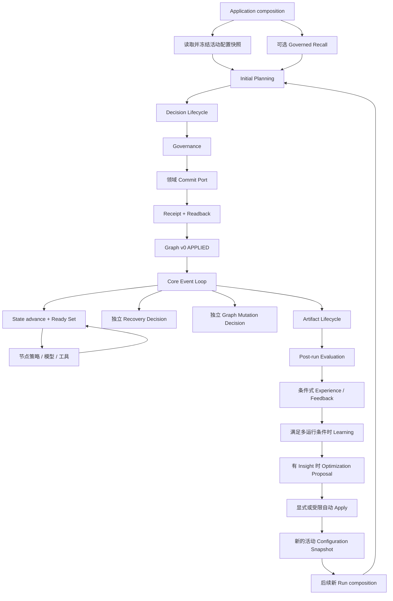
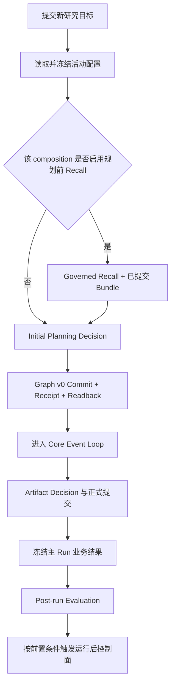
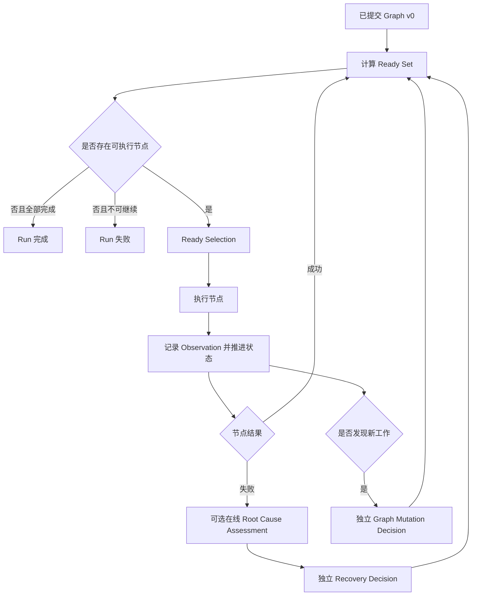
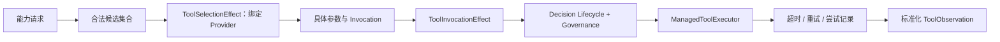
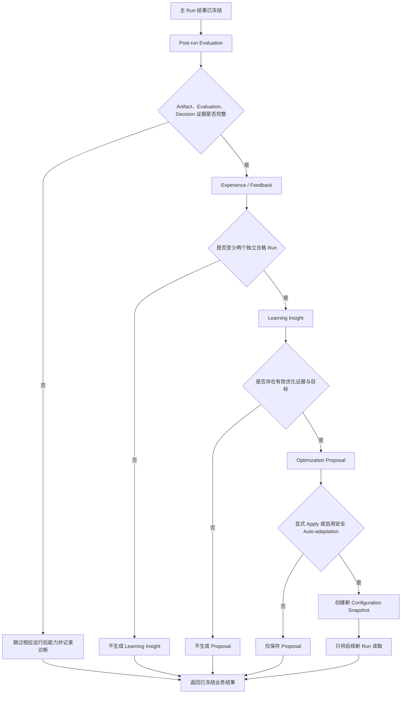
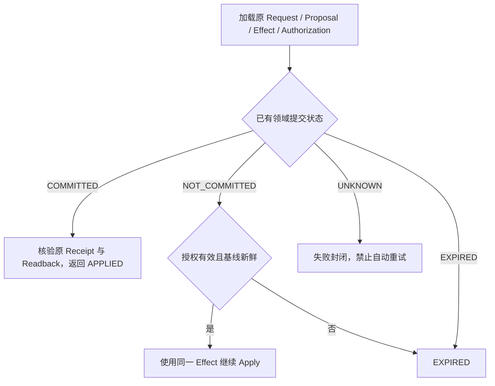
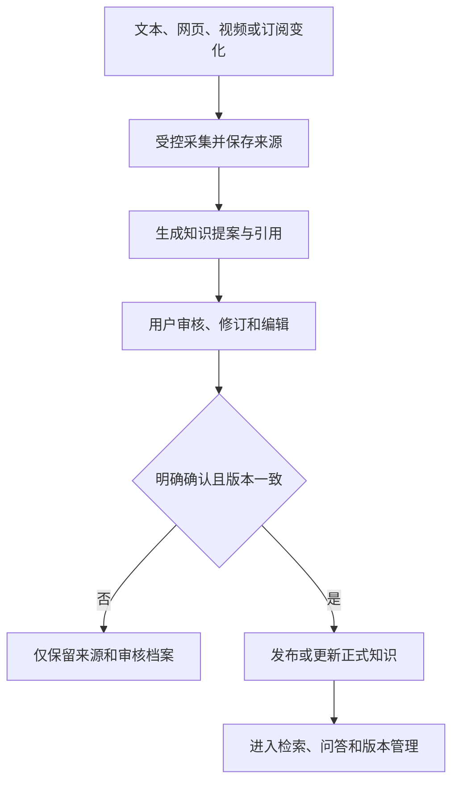

# 系统功能设计说明

> 本说明由当前项目代码、运行配置和自动化测试反向整理，不引用项目内已有设计文档。内容描述当前代码实际体现的产品功能、业务规则、触发时序和能力边界，不展开类设计、目录结构或技术架构。

## 1. 系统功能概述

### 1.1 系统整体用途

当前系统是一套面向自适应智能体的受控运行系统，并提供投资研究和个人知识管理两个应用。

系统将开放式目标转化为可执行任务，在受控条件下使用模型、工具、上下文和跨运行记忆；对有权威状态影响的操作执行提案校验、治理授权、领域提交、独立回读和结果追踪；运行结束后可进行质量评估，并在证据和作用域满足条件时形成经验、反馈、学习结论和有限配置优化。

### 1.2 主要解决的问题

- 把用户目标转化为有依赖、可执行、可恢复的任务过程。
- 防止模型建议、工具意图或未经校验的数据直接改变权威状态。
- 在有限容量内装配上下文，并管理有证据、有条件、有版本的跨运行记忆。
- 保存任务状态、决策、授权、产物、评估和配置，使中断后能够按原决定继续或安全停止。
- 用正式产物、运行结果和提交回执形成可审计的运行后证据链。
- 将个人资料转化为经过用户确认、可检索、可追溯的知识。

### 1.3 当前实现的核心能力

- 运行前 Initial Planning，以及 Graph v0 的受治理提交。
- Core Event Loop 内的状态推进、Ready Set 计算、节点执行、失败传播、Recovery 和 Graph Mutation。
- 独立的 Decision Lifecycle 协调：请求、上下文投影、提案、校验、规范化 Effect、治理、应用、提交回读、追踪和检查点。
- 工具候选选择、Provider 绑定、具体 Invocation 授权，以及带超时和重试的受管执行。
- 上下文装配、容量控制、持久化压缩与归档、受条件约束的记忆召回和不可变记忆演进。
- 规则、风险、置信度、人工复核、授权预留与消费、重放防护。
- 正式 Artifact 的草稿、校验、Effect、提交回执、独立回读和来源证明。
- 运行后 Evaluation，以及与其分离的在线失败 Root Cause Assessment。
- 有前置条件的 Experience、Decision Feedback、Learning Insight、Optimization Proposal 和配置快照应用。
- 投资研究和个人知识管理的完整业务入口与本地工作台。
- 各权威领域自己的持久化、幂等、冲突检测和 reconciliation；系统不宣称存在覆盖所有领域的单一全局事务。

## 2. 功能模块设计

### 2.1 投资研究

**功能目标**

根据公司研究目标组织研究任务，并输出带财务、行业、竞争、新闻和风险观点的结构化报告。

**功能描述**

研究应用在新 Run 启动时读取并冻结配置快照，可选执行一次受治理记忆召回，然后完成 Initial Planning 和 Graph v0 提交。进入 Core Event Loop 后，系统推进公司、财务、行业、竞品和风险节点，并可通过独立 Graph Mutation 增加新闻任务。最终报告通过正式 Artifact 提交流程发布；随后才进入不会改写报告的运行后控制面。

**包含的主要功能点**

- 研究目标提交和公司识别。
- 离线演示研究和模型研究两种信息模式。
- 可选 Initial Planning 记忆召回和冻结配置读取。
- 公司、财务、指标、行业、竞品、新闻和风险研究。
- 动态新闻节点和依赖调整。
- 结构化报告生成、正式提交、Markdown 展示和实时进度。
- 同步运行、异步运行、结果查询和中断恢复。
- 运行后评估，以及条件式经验、反馈、学习、优化和可选自动适应。

**与其他功能模块的关系**

研究应用负责组合各项可复用能力及其触发顺序；Initial Planning、Core Event Loop、Artifact 提交和运行后控制面是相互分离的阶段，并非 Core Runtime 默认执行的一条持续重规划循环。

### 2.2 个人知识管理

**功能目标**

把文本、网页、视频或订阅内容转化为可审阅、可确认、可检索、可追溯的个人知识。

**功能描述**

来源内容先进入来源档案，再生成知识提案和审核会话。用户可以继续对话修订，也可以编辑标题、正文、分类、标签和引用。只有明确确认且版本校验通过时，内容才会进入正式知识库。该应用复用工具、模型、治理、记忆和持久化能力，但不自动继承研究应用的 Recall、Learning 或 Optimization 编排。

**包含的主要功能点**

- 文本、想法、网页和视频来源采集。
- 原文、转录、时间片段和引用归档。
- 知识提案、长内容分段综合和审核对话。
- 明确确认发布、修订、删除与恢复。
- 分类创建、重命名、停用和合并。
- 当前知识和历史版本保存。
- 正式知识全文检索、可选来源检索和有引用问答。
- 来源订阅、内容变更检测和定时轮询。
- 明确偏好记忆、推断偏好建议和确认写入。

**与其他功能模块的关系**

内容采集依赖工具调用边界；综合和问答可使用模型；正式知识写入依赖用户确认和版本校验；偏好写入使用记忆领域的演进与提交语义。

### 2.3 Decision Lifecycle 协调

**功能目标**

为一次受控决定提供完整、可恢复的协调流程，确保 Agent 只提出建议，Runtime 才能形成并应用权威 Effect。

**功能描述**

一次完整决策按以下功能阶段推进：

`Request → Context Projection → Proposal → Validation → Normalized Effect → Governance → Apply → Commit/Readback → Trace/Checkpoint`

Decision Lifecycle 负责阶段协调、预算、检查点、恢复和最终状态；Governance 仅负责评估、复核和签发授权，是生命周期中的一个控制步骤，不是生命周期本身。Decision Lifecycle 不负责任务调度，也不运行 Core Event Loop。

**包含的主要功能点**

- 受控请求和决定对象建立。
- 按策略投影 Agent 可见上下文。
- 接收无权威变更能力的 Proposal。
- Runtime 校验 Proposal 并生成 Normalized Effect。
- 调用 Governance 取得拒绝、复核或授权结果。
- 使用与 Effect 绑定的 Permit 进入领域应用边界。
- 获取领域 Commit Receipt，并独立回读验证提交结果。
- 保存阶段检查点、追踪记录和最终 Decision Result。
- 从原 Request、Proposal、Effect 和 Authorization 恢复，不重新调用 Agent 生成提案。

**与其他功能模块的关系**

Initial Planning、工具选择、工具调用、上下文压缩、记忆、Graph Mutation、Recovery、Artifact、Experience、Feedback、Learning 和 Optimization 等领域可通过该协调流程完成自己的决策；Governance 和领域 Commit Port 分别是其控制依赖和提交依赖。

### 2.4 Initial Planning

**功能目标**

在 Core Event Loop 启动前把目标转换为初始任务图，并先形成经验证、经治理且可回读的 Graph v0。

**功能描述**

当前研究应用的新 Run 会先读取冻结配置，可选使用一次已提交的 Recall Bundle，然后执行一次受预算约束的 Initial Planning Decision。只有 Graph v0 Commit 完成且回读一致后，才构造 Core Event Loop 所需的初始任务状态。Initial Planning 不是 Event Loop 内反复调用的 Planner Agent。

**包含的主要功能点**

- 新 Run 的初始目标解析。
- 冻结配置快照读取。
- 研究 composition 中可选的一次 Governed Recall。
- 单次规划提案、图约束校验和 Graph v0 Effect。
- Graph v0 授权、提交、回执和回读。
- 中断后恢复原规划 Decision，不重新生成 Proposal。

**与其他功能模块的关系**

Initial Planning 位于应用编排和 Core Event Loop 之间。Optimization 不直接调用或修改它；后续新 Run 通过应用 composition 读取新的活动配置快照，已开始 Run 始终使用启动时冻结的快照。

### 2.5 Core Event Loop 与任务图控制

**功能目标**

根据已提交任务图持续推进状态，在依赖满足时执行节点，并在受限条件下处理失败或变更任务图。

**功能描述**

每个节点完成后，Runtime 记录 Observation、更新节点和运行状态、传播依赖失败并重新计算 Ready Set。若多个节点同时就绪，可以使用稳定规则或受约束的 Ready Selection。失败时可独立触发 Recovery；运行中发现新增需求时可独立触发 Graph Mutation。正常节点完成不会重新调用 Initial Planner Agent。

**包含的主要功能点**

- 任务图分支、汇合和依赖校验。
- Observation 驱动的状态推进。
- Ready Set 计算和受限就绪节点选择。
- 依赖失败传播和阻塞。
- 独立 Recovery Decision。
- 独立 Graph Mutation Decision。
- 最大步骤、最大节点和恢复次数限制。

**与其他功能模块的关系**

该模块消费已提交 Graph v0，调用节点策略、工具或模型能力，并把结果形成 Observation。它与运行前 Initial Planning、运行后 Evaluation/Learning/Optimization 是三个不同控制面。

### 2.6 工具与外部能力使用

**功能目标**

将“选谁执行”“允许执行什么”和“怎样实际执行”分离，避免模型建议或 Provider 选择直接触发外部副作用。

**功能描述**

工具处理分为三个边界：

- `ToolSelectionEffect`：只从 Runtime 提供的合法候选中绑定 Provider，不能调用 Provider。
- `ToolInvocationEffect`：绑定具体 Provider、参数、Invocation 及其依据，经过治理后才取得执行授权。
- `ManagedToolExecutor`：执行具体 Invocation，负责可用性检查、超时、重试、尝试记录和标准化 Observation。

模型可参与候选建议或返回 Tool Intent，但不能绕过 Runtime 校验、Decision Lifecycle 和 Managed Execution。

**包含的主要功能点**

- 能力和 Provider 登记。
- 候选筛选、稳定选择和模型辅助选择。
- 合法 Provider 绑定与选择证据保存。
- Invocation 参数、Provider、选择依据和 Effect 一致性校验。
- 治理授权和 Permit 绑定。
- 超时、重试、候选切换、取消和尝试轨迹。
- 成功或失败 Observation 标准化。

**与其他功能模块的关系**

领域 Decision Handler 产生 Runtime-normalized Effect，Decision Lifecycle 调用 Governance；工具模块本身不向 Governance 提交任意模型对象。真正外部执行只发生在 Permit-bound Executor 中。

### 2.7 模型与认知能力

**功能目标**

把模型作为可替换、可探测、受预算和输出契约约束的建议能力，而不是权威状态变更者。

**功能描述**

系统支持远程、本地和命令行会话模型目标，可探测可用性、认证和模型列表，并按能力、标签和预算路由。模型输入由各领域投影，输出必须满足结构约束；模型结果只能成为 Proposal、Draft、Assessment 或 Tool Intent。

**包含的主要功能点**

- 多模型目标配置、敏感配置隔离和遮蔽。
- 连接探测、模型发现和运行时切换。
- 能力协商、路由、重试、回退和预算。
- 结构化输出校验。
- 规划、内容生成、证据判断、Root Cause、Recovery、工具选择、上下文压缩和记忆提取建议。
- 上下文敏感级别、字段脱敏和外发容量控制。

**与其他功能模块的关系**

模型不直接调用 Governance，也不直接修改 Graph、Context、Memory、Artifact 或 Configuration。领域处理模块先验证模型输出并生成 Normalized Effect，再由 Decision Lifecycle 调用 Governance。

### 2.8 上下文管理

**功能目标**

在容量和敏感性边界内，为当前决策或节点提供相关信息，并安全处理压缩、归档和恢复。

**功能描述**

上下文按工作、任务和语义层装配。持久化压缩先创建对查询不可见的 pending archive；Commit 时在领域事务中同时发布归档和新的 resident revision，并保存回执。中断后根据同一 Effect 进行 reconciliation，而不是先暴露部分权威状态再补偿删除。

非事务型或内存兼容路径仍保留 best-effort discard 行为，但不代表默认持久化路径的权威提交语义。

**包含的主要功能点**

- 多来源上下文采集和分层装配。
- 必需内容优先、容量限制和敏感信息过滤。
- Context Projection 的 allowlist 和 deny-by-default。
- pending archive 不可见。
- 归档与新 resident revision 的领域原子发布。
- 按原 Effect 恢复、过期或未知状态封闭。

**与其他功能模块的关系**

Context Projection 是 Decision Lifecycle 的早期阶段；上下文领域自己的 Commit Port 负责压缩和归档提交，不是 Governance 的内部存储能力。

### 2.9 跨运行记忆

**功能目标**

保存带作用域、条件、证据、敏感级别和置信度的跨运行信息，并保留完整演进历史。

**功能描述**

记忆支持 EXTEND、SUPPORT、MODIFY 和 CONFLICT 四种演进方式。EXTEND 创建新记录；其他方式均基于当前记录创建新 revision，并更新 current pointer，不原地覆盖既有 content、confidence、status 或 evidence。SUPPORT 保留内容并追加证据；MODIFY 在约束内形成新内容 revision；CONFLICT 保留原内容、记录冲突并形成新的 conflicted revision。

Recall 不是所有 Runtime 的固定步骤。当前研究 composition 只在 Initial Planning 前执行一次 Governed Recall，节点 Context 不执行未治理的动态召回；个人知识偏好召回属于该应用自己的组合。

**包含的主要功能点**

- 条件、标签、作用域、状态和敏感性筛选。
- Recall Proposal、Effect、Bundle、回执和结果反馈。
- EXTEND 新建记忆。
- SUPPORT、MODIFY、CONFLICT 创建不可变新 revision。
- 批量候选提交、幂等和冲突检测。
- 记忆历史与 current revision 查询。

**与其他功能模块的关系**

Memory 可作为 Experience 的来源引用，但不是 Learning Insight 的直接权威证据源。Learning 的直接证据来自 Experience Metadata、Decision Feedback、Evaluation、Artifact provenance 及对应 receipts。

### 2.10 Governance 与授权

**功能目标**

根据规则、风险、置信度和人工复核结果决定某个已规范化 Effect 是否可以进入应用阶段。

**功能描述**

Governance 接收由 Decision Lifecycle 提交的 Normalized Effect，形成允许、拒绝或要求复核的结果；批准后签发绑定 operation、target 和 subject fingerprint 的 Authorization/Permit。授权状态区分 reserve、consume 和失败结果，不能用“失败后永远不可再用”概括所有中断场景。

**包含的主要功能点**

- 规则、风险和置信度评估。
- 人工复核、等待状态和跨进程继续。
- 授权签发、预留、消费和重放防护。
- operation、target、subject 和有效期绑定。
- 错配、伪造、过期和重复消费拒绝。

**与其他功能模块的关系**

Governance 是 Decision Lifecycle 中的控制节点。它不负责上下文投影、Proposal 生成、Runtime 校验、领域 Commit、回读或 Decision 完成状态，也不是持久化的唯一上游。

### 2.11 Artifact 与 Workspace Commit

**功能目标**

把业务生成内容转化为具有独立提交回执、可回读且可证明来源的正式产物。

**功能描述**

正式 Artifact 经历 Draft、Validation、Normalized Artifact Effect、Governance、Permit-bound Commit、Commit Receipt 和独立 Readback。产物策略只能生成 Draft，不能直接写入 Workspace。重复提交同一 Effect 返回原结果；同一身份但内容冲突时拒绝提交。

**包含的主要功能点**

- Artifact Draft 和来源引用。
- 结构、内容、来源和目标校验。
- 正式 Artifact Effect。
- 独立授权和 Workspace Commit。
- Commit Receipt、fingerprint 回读和 provenance。
- 幂等返回、冲突拒绝和中断 reconciliation。

**与其他功能模块的关系**

Artifact 是独立的权威领域边界，不是普通持久化写入。Evaluation、Experience 和 Feedback 只能引用已经正式提交并可验证的 Artifact。

### 2.12 Evaluation 与 Root Cause

**功能目标**

分别处理运行后质量判断和运行中的语义失败诊断，避免把两者合并为同一时序。

**功能描述**

Post-run Evaluation 在主 Run 形成终态和正式产物后检查结果、轨迹及组件表现。Semantic Root Cause Assessment 则有两种触发：节点失败后、Recovery 之前的在线诊断；以及运行后的补充诊断。在线 Assessment 只有在证据校验和治理通过后才可进入 Recovery 上下文，不能修改已完成报告。

当前默认 Runtime 仍生成当前 Run 的确定性失败汇总和只读候选，但不会累积旧 `_evaluation_history`，也不会自动进入旧的 Deterministic Failure Analyzer → Legacy Optimization 链路。旧优化代理只保留为 legacy/test-only 能力。

**包含的主要功能点**

- 结果达成、过程轨迹和组件评估。
- 评估报告和结果回执。
- 当前 Run 的确定性失败分组和只读候选。
- 节点失败后的可选在线 Root Cause Assessment。
- 运行后的可选 Root Cause Assessment。
- Root Cause 与 Recovery 之间的证据准入。

**与其他功能模块的关系**

Evaluation 是 Experience 和 Feedback 的前置证据；在线 Root Cause 位于失败 Observation 与 Recovery Decision 之间。两者都不能反向改写已经冻结的业务产物。

### 2.13 Experience、Feedback 与 Learning

**功能目标**

把已提交的运行事实转化为可审计证据，并在多个独立运行满足条件时形成关联性学习结论。

**功能描述**

Experience 需要终态 Run、可验证 Artifact 和 Evaluation。Decision Feedback 还需要可定位的 APPLIED subject Decision，并将运行结果与 Initial Planning 或 Recall Decision 关联。Learning 至少需要两个独立且同作用域的合格运行；首个 Run 通常不会生成 Learning Insight。证据不足、冲突或来源校验失败时不会形成正向结论。

Learning 的直接权威输入是 Experience Metadata、Decision Feedback、Evaluation、Artifact provenance 和 receipts。Memory 仅可通过 Experience 来源或 Recall 关联间接出现，不是直接学习证据。

**包含的主要功能点**

- append-only Experience Metadata。
- Initial Planning 和 Recall Decision Feedback。
- Evaluation、Artifact、Decision 和 receipt 一致性验证。
- 至少两个独立运行的 Learning Evidence 集合。
- 反证和证据不足保留。
- Learning Insight 的受治理提交和版本保存。
- 禁止 Learning Insight 直接注入 Planning 或 Recall。

**与其他功能模块的关系**

这三个能力使用 Runtime contracts、Governance、Decision Lifecycle 和 stores，但触发顺序由研究应用 composition 负责，不是每个 Runtime 或每个 Run 都必然执行成功的固定流水线。

### 2.14 Optimization、Configuration 与 Auto-adaptation

**功能目标**

将学习结论转化为只读优化提案，并通过独立申请形成仅影响后续新 Run 的配置快照。

**功能描述**

Optimization Proposal 需要有效 Learning Insight；没有 Insight 时不生成 Proposal。Proposal 不直接调用或修改 Initial Planning。显式 Apply 或 Rollback 经独立校验和治理后创建新的不可变 Configuration Snapshot。下一次新 Run 的应用 composition 读取活动快照并冻结；当前 Run 不受影响。

Auto-adaptation 是主 Run 完成后的可选控制面，默认关闭，只支持固定 Research scope 下的 `planner.max_nodes`、单一低风险候选、无反证和有限幅度变化。其 Evidence、Ledger、Governance、Apply 或 reconciliation 失败只能形成隔离诊断，不得阻止已冻结业务结果返回。

**包含的主要功能点**

- 基于 Learning Insight 的 Optimization Proposal。
- Proposal 与配置 Apply 分离。
- 基线新鲜度、目标白名单、作用域、风险和反证校验。
- 版本化 Configuration Snapshot 和活动版本。
- 显式 Apply、Rollback 和中断 reconciliation。
- 默认关闭、故障隔离的可选 Auto-adaptation。
- 后续新 Run 读取，当前 Run 冻结。

**与其他功能模块的关系**

正确依赖是 `Optimization → Configuration Snapshot → 后续新 Run composition → Initial Planning`，不存在 `Optimization → Planning` 的直接调用或原地修改关系。学习结论也不允许绕过 Proposal、Apply 和 Configuration 分层直接进入 Planning/Recall。

### 2.15 领域持久化、Resume 与追踪

**功能目标**

为各权威领域提供可恢复提交和审计证据，并在中断后依据真实提交状态决定继续、完成或停止。

**功能描述**

Persistence 不是 Governance 的单一下游模块，而是 State、Graph、Decision、Context、Memory、Recall、Artifact、Trace、Evaluation、Experience、Feedback、Learning、Optimization 和 Configuration 等领域的横切 Adapter/Commit Port。各领域有自己的事务、版本、幂等和回读边界；不同领域之间通过 Receipt 和 reconciliation 处理提交与 Decision 检查点之间的中断窗口，不构成一个统一跨模块事务。

Decision Resume 会恢复原 Request、Context/Proposal、Normalized Effect 和 Authorization。处于 Applying 的 Decision 根据领域查询结果处理：

- `COMMITTED`：验证并返回原 Receipt，完成 APPLIED。
- `NOT_COMMITTED`：在授权仍有效且基线新鲜时，用同一 Effect 继续 Apply。
- `EXPIRED`：终止原决定。
- `UNKNOWN`：失败封闭，禁止自动重试。

**包含的主要功能点**

- 各领域状态、历史、回执和 fingerprint 保存。
- 乐观版本校验、幂等查重和内容冲突拒绝。
- 决策阶段检查点和跨进程 Resume。
- 已提交回读、未提交续作、过期终止和未知封闭。
- 运行轨迹、决策轨迹和关联标识保存。
- 领域内原子提交；不承诺跨所有领域的全局原子性。

**与其他功能模块的关系**

每个权威领域直接依赖自己的 Commit Port。Governance 的复核和授权状态也需要持久化，但这不构成 `Governance → Persistence → Business` 的单线关系。

## 3. 功能清单

状态判定：完整触发、处理和可验证结果记为“已实现”；能力受固定 scope、默认关闭、外部依赖或入口限制记为“部分实现”；存在孤立兼容代码、占位或无法形成当前可用闭环时记为“疑似未完成”。有意禁止的行为改写为“边界控制”功能，不作为缺失功能。

| 功能模块 | 功能名称 | 功能说明 | 实现状态 |
| --- | --- | --- | --- |
| 投资研究 | 研究任务提交 | 接收研究目标并识别公司 | 已实现 |
| 投资研究 | 离线演示研究 | 使用稳定演示数据完成研究流程 | 已实现 |
| 投资研究 | 模型研究模式 | 使用已配置模型生成研究信息 | 已实现 |
| 投资研究 | 公司、财务、行业和竞品分析 | 形成分项研究结果 | 已实现 |
| 投资研究 | 动态新闻研究 | 通过独立 Graph Mutation 增加新闻节点 | 已实现 |
| 投资研究 | 独立风险复核 | 形成风险和反方观点 | 已实现 |
| 投资研究 | 结构化报告 | 生成报告 Draft 和 Markdown 展示 | 已实现 |
| 投资研究 | 正式报告提交 | 通过 Artifact Lifecycle 形成可回读正式产物 | 已实现 |
| 投资研究 | 同步、异步与实时进度 | 支持直接运行、后台运行、事件和结果查询 | 已实现 |
| 投资研究 | Run 恢复 | 按原检查点继续且不重新生成已保存 Proposal | 已实现 |
| 投资研究 | 专用实时证券数据 | 直接接入行情、公告或新闻平台并交叉验证 | 疑似未完成 |
| 个人知识 | 多来源采集 | 支持文本、想法、网页和视频 | 已实现 |
| 个人知识 | 来源与引用归档 | 保存原文、转录、时间片段和引用 | 已实现 |
| 个人知识 | 知识提案与审核 | 生成草稿并支持对话修订 | 已实现 |
| 个人知识 | 明确确认发布 | 版本一致时写入正式知识 | 已实现 |
| 个人知识 | 修订、删除与恢复 | 对已有知识执行受控生命周期操作 | 已实现 |
| 个人知识 | 分类管理 | 创建、重命名、停用和合并 | 已实现 |
| 个人知识 | 知识版本保存 | 保存当前和历史 revision | 已实现 |
| 个人知识 | 历史版本网页浏览 | 在现有网页查看单条知识完整历史 | 疑似未完成 |
| 个人知识 | 正式知识检索 | 默认检索已确认且未删除内容 | 已实现 |
| 个人知识 | 来源档案检索 | 可选把来源和转录加入结果 | 已实现 |
| 个人知识 | 有证据问答 | 只基于本次检索证据回答并返回引用 | 已实现 |
| 个人知识 | 订阅创建与轮询 | 创建网页或视频订阅并检测变化 | 已实现 |
| 个人知识 | 订阅编辑、停用与删除 | 通过用户入口维护既有订阅 | 疑似未完成 |
| 个人知识 | 明确偏好记忆 | 用户确认后写入应用专属记忆 | 已实现 |
| 个人知识 | 推断偏好建议 | 从审核行为生成候选，不直接写入 | 部分实现 |
| Decision Lifecycle | 完整决定协调 | 按 Request 至 Trace/Checkpoint 的阶段推进 | 已实现 |
| Decision Lifecycle | Proposal 权限隔离 | Agent Proposal 不能直接形成权威写入 | 已实现 |
| Decision Lifecycle | Runtime Effect 规范化 | Runtime 验证并生成具体 Effect | 已实现 |
| Decision Lifecycle | APPLIED 判定 | 权威领域提交、Receipt 和 fingerprint 回读后完成 | 已实现 |
| Decision Lifecycle | 原决定 Resume | 恢复原 Request、Proposal、Effect 和 Authorization | 已实现 |
| Initial Planning | 运行前规划 | 在 Core Event Loop 前生成初始图 | 已实现 |
| Initial Planning | Graph v0 Commit | 治理、提交和回读完成后再启动 Event Loop | 已实现 |
| Initial Planning | 冻结配置读取 | 每个新 Run 固定其启动配置 | 已实现 |
| Initial Planning | 可选 Recall Bundle | 研究 composition 可在规划前绑定已提交记忆召回 | 已实现 |
| Core Event Loop | 状态推进 | 节点完成后记录 Observation 和新状态 | 已实现 |
| Core Event Loop | Ready Set 计算 | 依据依赖和节点状态计算可执行集合 | 已实现 |
| Core Event Loop | 就绪节点选择 | 在 Runtime 给定集合内稳定或模型辅助选择 | 已实现 |
| Core Event Loop | 依赖失败传播 | 阻止依赖失败节点继续执行 | 已实现 |
| Core Event Loop | Recovery | 失败时独立触发受治理恢复决定 | 已实现 |
| Core Event Loop | Graph Mutation | 需要时独立增加节点或依赖 | 已实现 |
| 工具 | 能力与 Provider 登记 | 维护能力及多个提供者 | 已实现 |
| 工具 | ToolSelectionEffect | 只绑定合法 Provider，不执行调用 | 已实现 |
| 工具 | ToolInvocationEffect | 授权并绑定具体 Invocation | 已实现 |
| 工具 | ManagedToolExecutor | 真正执行、超时、重试和尝试记录 | 已实现 |
| 工具 | 候选切换 | 失败恢复时可改选合法 Provider | 已实现 |
| 工具 | Observation 标准化 | 统一返回成功和失败结果 | 已实现 |
| 模型 | 多目标配置与探测 | 配置、探测、发现和切换模型目标 | 已实现 |
| 模型 | 能力协商与路由 | 按能力、标签和策略路由 | 已实现 |
| 模型 | 预算与结构校验 | 限制次数、时间、成本、长度并验证输出 | 已实现 |
| 模型 | Tool Intent 回交 | 模型只返回意图，由 Runtime 处理 | 已实现 |
| 模型 | 权威写入隔离 | 模型不能直接写 Graph、Memory、Artifact 或 Configuration | 已实现 |
| 上下文 | 多来源分层装配 | 按层级、优先级和容量装配 | 已实现 |
| 上下文 | 敏感信息投影 | allowlist、脱敏和 deny-by-default | 已实现 |
| 上下文 | pending archive 隔离 | 提交前归档对正式查询不可见 | 已实现 |
| 上下文 | 压缩原子发布 | 归档与新 resident revision 同事务发布 | 已实现 |
| 上下文 | 压缩 reconciliation | 按同一 Effect 继续、过期或未知封闭 | 已实现 |
| 记忆 | 条件 Recall | 按 scope、事实、标签、状态和敏感性筛选 | 已实现 |
| 记忆 | Initial Planning Recall | 研究新 Run 在规划前可执行一次受治理召回 | 已实现 |
| 记忆 | EXTEND | 创建新 Memory 记录 | 已实现 |
| 记忆 | SUPPORT | 创建追加证据的新 revision | 已实现 |
| 记忆 | MODIFY | 创建内容变化的新 revision | 已实现 |
| 记忆 | CONFLICT | 创建保留冲突的新 revision | 已实现 |
| 记忆 | 批量提交 | 同一批候选按领域事务提交 | 已实现 |
| Governance | 规则、风险和置信度 | 形成允许、拒绝或复核结论 | 已实现 |
| Governance | 人工复核检查点 | 保存待复核状态并支持继续 | 已实现 |
| Governance | 面向审批人的完整研究操作台 | 查看和处理真实待复核队列 | 疑似未完成 |
| Governance | Authorization/Permit 绑定 | 绑定 operation、target、subject 和有效期 | 已实现 |
| Governance | reserve/consume | 区分预留、成功消费和失败状态 | 已实现 |
| Governance | 重放与错配拒绝 | 拒绝伪造、过期、错配和不安全重放 | 已实现 |
| Artifact | Artifact Draft | 生成不具写入权限的产物草稿 | 已实现 |
| Artifact | Artifact Effect | Runtime 验证并绑定正式提交内容 | 已实现 |
| Artifact | Workspace Commit | Permit-bound 正式提交 | 已实现 |
| Artifact | Receipt 与 Readback | 独立回读并核验 fingerprint | 已实现 |
| Artifact | provenance | 保存产物与来源 Decision、Evidence 的关联 | 已实现 |
| Evaluation | 结果评估 | 检查终态和必需输出 | 已实现 |
| Evaluation | 过程与组件评估 | 检查轨迹、工具、上下文和记忆表现 | 已实现 |
| Evaluation | 当前 Run 确定性失败汇总 | 生成只读失败分组和候选 | 已实现 |
| Root Cause | 在线失败诊断 | 节点失败后、Recovery 前形成可选 Assessment | 已实现 |
| Root Cause | Post-run 诊断 | 运行后形成补充 Assessment | 已实现 |
| Experience | Experience Metadata | 从终态 Run、Artifact 和 Evaluation 生成 | 已实现 |
| Feedback | Decision Feedback | 关联 APPLIED Planning/Recall 与实际结果 | 已实现 |
| Learning | 多运行 Insight | 至少两个独立合格运行后形成结论 | 已实现 |
| Learning | 直接证据验证 | 校验 Experience、Feedback、Evaluation、Artifact 和 receipts | 已实现 |
| Learning | 直接注入 Planning/Recall 禁止 | 阻止 Insight 绕过优化分层改变规划或召回 | 已实现 |
| Optimization | Optimization Proposal | 有有效 Insight 时形成只读建议 | 已实现 |
| Optimization | Proposal 与 Apply 分离 | 保存 Proposal 不改变运行配置 | 已实现 |
| Configuration | 显式 Apply | 独立请求后创建新配置 revision | 部分实现 |
| Configuration | Rollback | 通过新 revision 恢复先前值 | 部分实现 |
| Auto-adaptation | 可选后运行控制面 | 默认关闭并与主 Run 结果故障隔离 | 部分实现 |
| Optimization | 目标白名单 | 当前仅允许固定 scope 的 planner.max_nodes | 已实现 |
| Scope | Memory 领域隔离 | tenant、project 和 agent scope 进入 Memory 记录 | 已实现 |
| Scope | Learning/Optimization 领域隔离 | 领域记录和 fingerprint 带 scope | 已实现 |
| Scope | 全链路动态多租户贯穿 | Experience/Feedback 到 Learning/Optimization 全部由上游动态 scope 驱动 | 部分实现 |
| Persistence | 领域 Commit Port | 各权威领域使用自己的提交和回读边界 | 已实现 |
| Persistence | 领域内幂等和冲突检测 | 重复 Effect 返回原结果，内容冲突拒绝 | 已实现 |
| Persistence | 决策 reconciliation | 区分 COMMITTED、NOT_COMMITTED、EXPIRED、UNKNOWN | 已实现 |
| 运行界面 | 研究命令行和网页 | 提交任务、查看进度、结果和模型设置 | 已实现 |
| 运行界面 | 个人知识网页 | 管理采集、审核、知识、搜索和设置 | 已实现 |
| 运行界面 | 用户账户与远程多租户权限 | 登录、角色、租户和远程协作 | 疑似未完成 |

> “每节点重新调用 Initial Planner”“通用 Runtime 自动 Recall”“跨 Run 旧失败历史默认闭环”和“全局跨领域统一事务”不是当前已实现功能，也不是本功能清单中的待补齐项。“多参数自优化”和“Learning 直接注入 Planning/Recall”受现行安全边界明确限制，同样不标记为遗漏功能。

## 4. 功能关系说明

### 4.1 功能层次

**基础控制能力**

- Decision Lifecycle、Governance、Authorization 和 Resume。
- 领域 Commit Port、Receipt、Readback、reconciliation 和 Trace。
- Context Projection、Memory、模型输出校验和工具受管执行。

**核心业务与运行能力**

- 投资研究和个人知识业务编排。
- 运行前 Initial Planning 和 Graph v0 Commit。
- Core Event Loop、Ready Selection、Recovery 和 Graph Mutation。
- Artifact 正式提交。

**运行后增强能力**

- Post-run Evaluation 和诊断。
- 条件式 Experience、Feedback、Learning 和 Optimization Proposal。
- 显式配置 Apply、Rollback 和可选 Auto-adaptation。

### 4.2 模块依赖关系

依赖规则：

- Decision Lifecycle 包含 Governance 调用，但不属于 Governance 内部能力。
- 模型、工具和上下文不直接提交任意对象给 Governance；领域处理先形成 Normalized Effect。
- Persistence 横切多个领域；不存在 `GOV → PERSIST → BIZ` 的单一链路。
- Optimization 不直接依赖或修改 Planning；只通过新配置快照影响后续新 Run。
- Recall、Experience、Feedback、Learning、Optimization 和 Auto-adaptation 的触发顺序由具体 Application composition 决定，不是 Core Runtime 的默认全套流程。

### 4.3 APPLIED 与事务边界

对 Graph、Context、Memory、Artifact、Experience、Feedback、Learning、Optimization Proposal 和 Configuration 等权威状态领域，`APPLIED` 表示：

1. 领域 Commit 已完成；
2. 存在与 Effect 绑定的 Commit Receipt；
3. 独立 Readback 找到已提交状态；
4. 回读 fingerprint 与 Receipt/Effect 一致；
5. Decision Result 才进入 APPLIED。

Governance Authorization 成功或 Apply callback 开始/返回，本身不等于权威状态已经 APPLIED。查询、advisory output、内存兼容路径和 legacy/test-only 路径不应套用与持久权威领域完全相同的保证。

事务保证按领域分别成立。Graph、Context Compression、Memory Batch、Artifact、Decision Result、Configuration Snapshot 等各自有提交边界，但系统没有把这些提交组合为单一跨领域事务；提交与 Decision Checkpoint 之间的崩溃窗口由 reconciliation 处理。

### 4.4 Scope 边界

- Memory 记录明确包含 tenant、project 和 agent scope。
- Learning Insight 在当前实现中只接受固定 `default / research / planner` scope 和 Initial Planning decision type。
- Optimization/Configuration 使用固定 `default / research / research_agent / planning.task_graph.initialize` scope，并仅允许 `planner.max_nodes`。
- Experience 和 Decision Feedback 主要以 run、task、decision、artifact 和 evaluation 关联，未完整携带动态 tenant/project/application/decision_type 四维 scope。
- 因此当前具备领域内 scope 校验，但不应描述为 Experience → Feedback → Learning → Optimization 全链路的通用动态多租户隔离。

## 5. 核心功能流程

### 5.1 新研究 Run 的主流程

**功能触发：** 用户提交新的研究目标。

**功能处理过程：** 应用读取并冻结配置；可选执行一次规划前 Governed Recall；Initial Planning 形成并提交 Graph v0；随后进入 Core Event Loop；正式报告经 Artifact Lifecycle 提交；业务结果冻结后进入运行后控制面。

**功能结果：** 返回完成或失败的 Run、正式报告或失败信息、任务图、轨迹和评估；条件满足时附带 Experience、Feedback、Learning、Optimization 或 Auto-adaptation 结果。

### 5.2 Decision Lifecycle

**功能触发：** 某领域需要形成或恢复一次受控决定。

**功能处理过程：** Runtime 保存请求、投影上下文、取得 Proposal、校验并生成 Normalized Effect、调用 Governance、使用 Permit 进入领域 Commit、回读并保存 Result/Trace。

**功能结果：** 返回 REJECTED、WAITING_REVIEW、EXPIRED、FAILED 或带 Commit Receipt 的 APPLIED；不会因为 Resume 而重新生成 Agent Proposal。

### 5.3 Core Event Loop

**功能触发：** Graph v0 已经正式提交并构造成运行状态。

**功能处理过程：** 计算 Ready Set、选择节点、执行并记录 Observation、更新状态和依赖，再次计算 Ready Set。失败时进入独立诊断/Recovery，新增工作需要独立 Graph Mutation。

**功能结果：** Run 进入完成或失败终态；正常节点完成不触发 Initial Planner Agent。

### 5.4 工具选择、授权与执行

### 5.5 运行后学习与优化

**功能触发：** 主 Run 已完成且正式 Artifact 和 Evaluation 可验证。

**功能处理过程：** Experience 与 Feedback 各自检查前置条件；Learning 聚合至少两个独立合格 Run；有有效 Insight 才评估 Optimization Proposal；Apply 为独立请求。Auto-adaptation 仅在启用和安全策略满足时执行，任何失败不得阻止已冻结业务结果返回。

### 5.6 Decision Resume

### 5.7 个人知识采集与发布

## 6. 当前系统能力总结

### 6.1 当前版本已经具备的功能

- 已实现独立 Decision Lifecycle，Governance 只是其中的评估与授权步骤。
- 已分离运行前 Initial Planning、Core Event Loop 控制和运行后 Evaluation/Learning/Optimization。
- 已实现 Graph v0 先提交再进入 Event Loop；节点完成只推进状态和 Ready Set，不持续重调 Initial Planner。
- 已实现 ToolSelectionEffect、ToolInvocationEffect 和 ManagedToolExecutor 三个不同边界。
- 已实现持久化 Context 压缩的 pending 不可见、领域原子发布和 reconciliation。
- 已实现不可变 Memory revision 演进；没有原地覆盖历史 revision。
- 已实现独立 Artifact 生命周期及提交回读。
- 已实现在线 Root Cause 与 post-run Evaluation 的时序分离。
- 已实现有前置条件的 Experience、Feedback、Learning 和 Optimization；它们不是每次 Run 固定成功的串行步骤。
- 已实现后续新 Run 读取配置快照，当前 Run 配置冻结；可选 Auto-adaptation 与主 Run 结果故障隔离。
- 已实现按领域的持久化、Receipt、Readback、幂等和 reconciliation。

### 6.2 可能存在但不完整的功能

- 研究默认使用演示数据；模型研究模式不等同于经专用证券、公告和新闻源验证的实时投研。
- 视频采集依赖外部转录能力可用。
- 人工复核状态与 Resume 已实现，但面向真实审批人的完整研究操作台未体现。
- 优化 Apply、Rollback 和 Auto-adaptation 只覆盖固定 Research scope 下的 `planner.max_nodes`；Auto-adaptation 默认关闭。
- Memory 和 Learning/Optimization 各自有 scope 校验，但 Experience/Feedback 到下游的动态多租户 scope 贯穿仅部分实现。
- 个人知识订阅缺少完整编辑、停用和删除入口；网页未体现知识历史版本浏览。
- advisory outputs、只读 query、内存兼容路径和 legacy/test-only 能力不具备与所有权威 Effect 相同的提交保证。

### 6.3 代码中未体现的功能

以下能力没有形成当前可用功能：

- 专用证券行情、财报公告、监管披露和实时新闻数据接入与交叉验证。
- 面向研究审批人的待办队列、审批界面和通知机制。
- 个人知识订阅完整生命周期入口和知识历史网页浏览。
- 用户注册、登录、角色权限、远程多用户协作和租户管理。
- 覆盖所有领域状态的单一全局事务。

以下行为属于当前有意的安全边界或明确非目标，不应记作“疑似缺失”：

- Learning Insight 直接进入 Planning 或 Recall。
- Optimization 直接调用或原地修改 Planning。
- 模型、工具或 Context 向 Governance 提交未经领域规范化的任意对象。
- 每个节点完成后重新调用 Initial Planner Agent。
- 所有 Runtime、所有节点固定先召回 Memory。
- 模型自行扩大到多参数或跨业务策略的通用自优化。

## 7. 关键查证结论

| 编号 | 查证结论 |
| --- | --- |
| 1 | 原说明有合并过度。Decision Lifecycle 是独立协调模块，Governance 只是其中一个阶段。 |
| 2 | 原说明有混淆。Initial Planning、Core Event Loop 控制、post-run Evaluation/Learning/Optimization 是三个控制面。 |
| 3 | “反馈给后续规划”不准确。实际是状态推进和 Ready Set 重算；只有必要时独立触发 Recovery/Graph Mutation。 |
| 4 | `OPT → PLAN` 不准确。应为 Optimization 形成新配置快照，由后续新 Run composition 读取。 |
| 5 | `GOV → PERSIST → BIZ` 不准确。Persistence 是多个权威领域的横切 Commit/Adapter 边界。 |
| 6 | `MODEL/TOOL/CTX → GOV` 过度简化。领域处理先生成 Normalized Effect，再由 Decision Lifecycle 调用 Governance。 |
| 7 | Initial Planning 不属于 Core Event Loop。Graph v0 先 Commit/Readback，之后才进入 Event Loop。 |
| 8 | 工具明确分为 Provider 选择、具体 Invocation 授权和 Managed Execution 三个阶段。 |
| 9 | 通用固定 Memory Recall 不成立。研究 composition 当前只在 Initial Planning 前接入一次 Governed Recall。 |
| 10 | 默认持久化 Context 压缩不采用“先暴露部分权威状态再补偿”。它使用 pending 不可见和事务发布；兼容路径另有 best-effort discard。 |
| 11 | Memory 演进不原地改写。除 EXTEND 新建外，SUPPORT/MODIFY/CONFLICT 都创建新 revision。 |
| 12 | Memory 不是 Learning 的直接权威证据。直接证据是 Experience、Feedback、Evaluation、Artifact provenance 和 receipts。 |
| 13 | 在线 Root Cause 可在节点失败后、Recovery 前执行；post-run Evaluation 是另一时序。 |
| 14 | 当前 Run 仍有只读确定性失败汇总，但旧跨 Run history → legacy optimization 默认链路已不在当前闭环。 |
| 15 | Experience、Feedback、Learning 和 Optimization 有不同前置条件，不是每次 Run 完成后的固定串行步骤。 |
| 16 | Auto-adaptation 是主 Run 结果冻结后的可选控制面，其失败不得阻止业务结果返回。 |
| 17 | Artifact/Workspace Commit 是独立领域边界，具有 Draft、Effect、Receipt、Readback 和 provenance。 |
| 18 | 权威状态的 APPLIED 需要 Commit、Receipt 和 fingerprint Readback；Authorization 或 callback 返回不等于 APPLIED。 |
| 19 | 一次性授权需区分 reserve/consume、同 Effect reconciliation、已提交返回原 Receipt 和 UNKNOWN 禁止重试。 |
| 20 | Resume 恢复原 Request、Proposal、Effect 和 Authorization，并按四种 reconciliation 状态处理，不重新生成 Proposal。 |
| 21 | 原“并发原子提交和失败回滚”表述过宽。原子性按领域成立，不是统一跨模块事务。 |
| 22 | Scope 隔离是部分实现：下游领域记录有 scope，但研究闭环仍使用固定 scope，上游 Experience/Feedback 未完整携带四维动态 scope。 |
| 23 | Learning 不直接进入 Planning/Recall 是有意安全边界，不是疑似缺失。 |
| 24 | 当前只允许固定 scope 的 `planner.max_nodes` 是安全白名单；通用多参数优化是现行非目标。 |
| 25 | Recall、Experience、Feedback、Learning、Optimization 和 Auto-adaptation 的顺序由 Application composition 负责，不是 Core Runtime 默认能力。 |
| 26 | “关键状态变更普遍具备全部保证”过宽。完整保证只应逐个适用于已进入统一 Effect/Commit/Readback 路径的权威领域。 |
